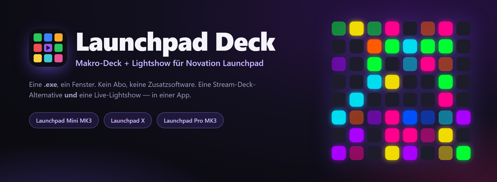
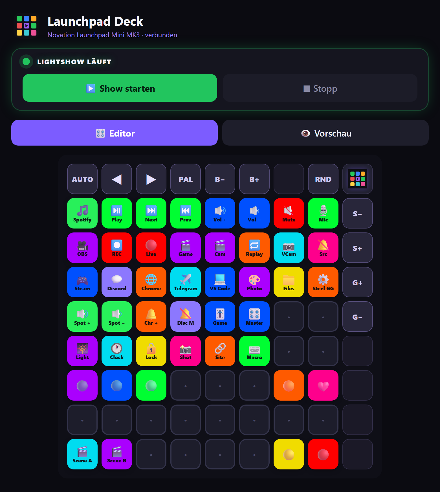
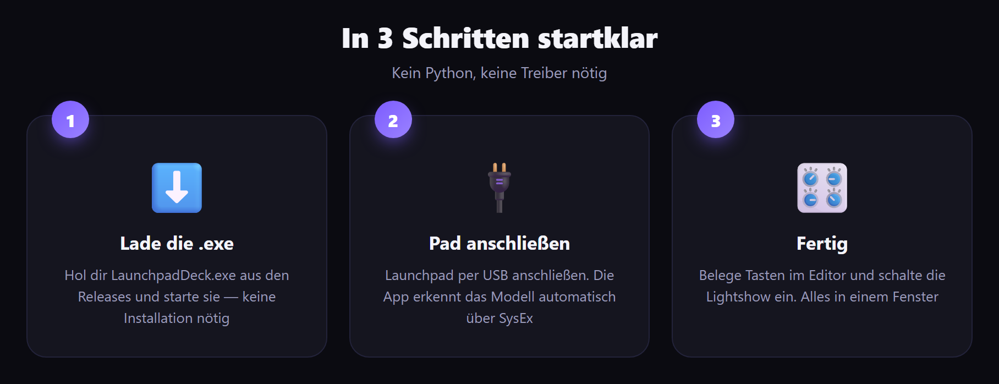
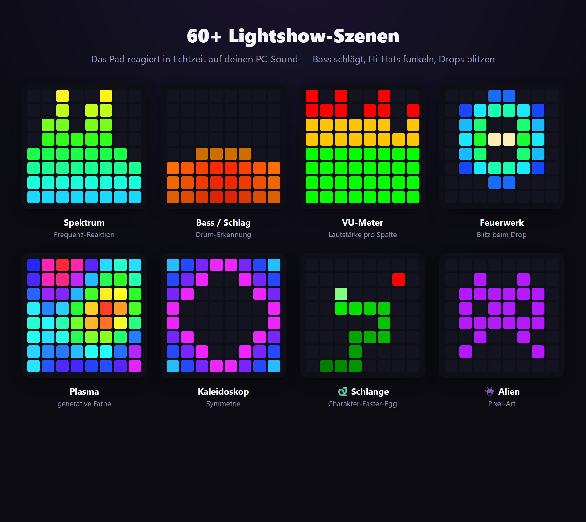
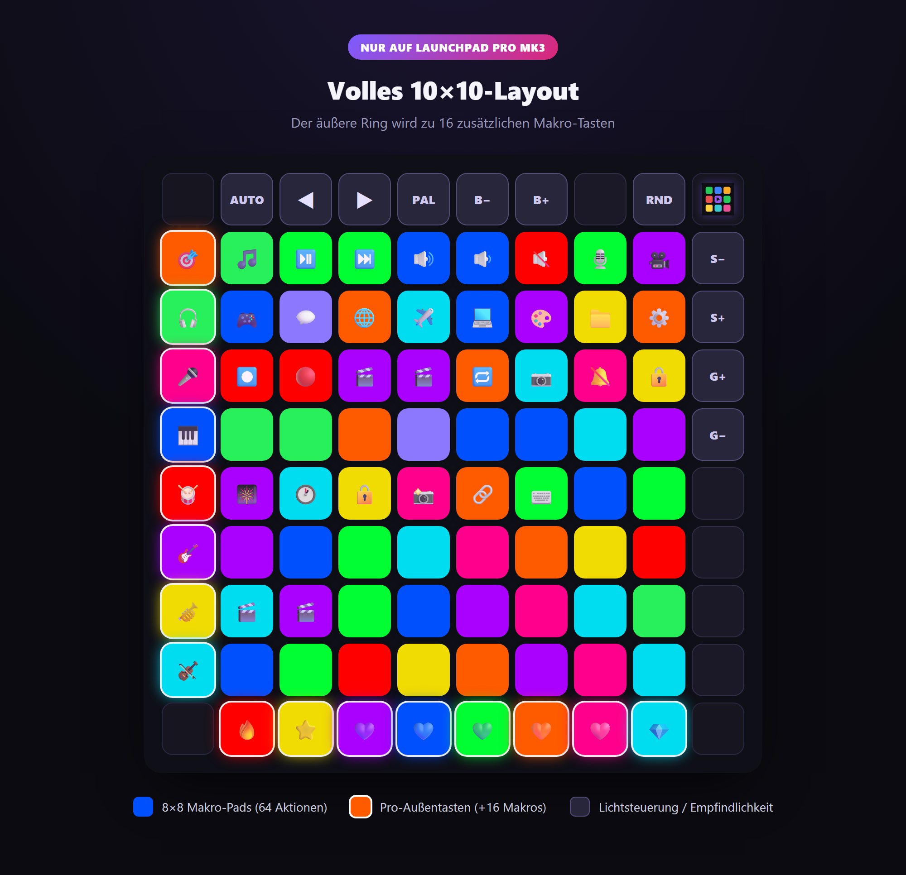

<div align="center">



<h1>Launchpad&nbsp;Deck</h1>

**Verwandle dein Novation Launchpad in ein Makro-Deck _und_ eine audioreaktive Lightshow — in einer App.**

<br>

[](../../releases/latest)
[](../../releases/latest)
[](../../releases)
[](../../stargazers)
[](#-aus-dem-quellcode-bauen)
[](https://t.me/universemusicrecords)
[](#-autor--rechte)

[Русский](README.md) · [English](README.en.md) · [Українська](README.uk.md) · 🌍 **Deutsch** · [Español](README.es.md) · [Français](README.fr.md)

`Novation Launchpad` · `Stream Deck alternative` · `macro deck` · `MIDI controller` · `audio-reactive light show` · `Launchpad Mini MK3` · `Launchpad X` · `Launchpad Pro MK3`

<br>

### [⬇️&nbsp;&nbsp;LaunchpadDeck.exe herunterladen&nbsp;&nbsp;→](../../releases/latest)

<br>



</div>

---

## 📖 Inhalt

- [✨ Was es ist](#-was-es-ist)
- [🚀 In 3 Schritten startklar](#-in-3-schritten-startklar)
- [🎛 Funktionen](#-funktionen)
- [🎆 Lightshow](#-lightshow)
- [🎹 Unterstützte Geräte](#-unterstützte-geräte)
- [🧩 Aktionen & Parameter](#-aktionen--parameter)
- [💡 Fertige Layouts](#-fertige-layouts)
- [🎥 OBS einrichten](#-obs-einrichten)
- [🗂 Profile, Sprachen, Autostart](#-profile-sprachen-autostart)
- [❓ Fragen & Fehlerbehebung](#-fragen--fehlerbehebung)
- [🛠 Aus dem Quellcode bauen](#-aus-dem-quellcode-bauen)
- [👤 Autor & Rechte](#-autor--rechte)

---

## ✨ Was es ist

**Launchpad Deck** macht aus deinem Novation-Leuchtpad zwei Dinge auf einmal:

- 🎛 **Makro-Deck** (wie ein Stream Deck) — belege Tasten mit App-Start, Medien & Lautstärke, Mikrofon-Mute (funktioniert in Discord), PC-Sperre, Tastenkürzeln, **OBS**-Steuerung und vielem mehr.
- 🎆 **Lightshow** — das Pad reagiert auf deinen PC-Sound: Bass schlägt, Hi-Hats funkeln, Drops blitzen. **60+** Szenen mit Animationen und Charakteren.

Alles in einem Fenster, einer `.exe` — Python und Bibliotheken musst du **nicht** installieren. Kein Abo. Keine Cloud. Läuft offline.

---

## 🚀 In 3 Schritten startklar

<div align="center">



</div>

1. Lade **[`LaunchpadDeck.exe`](../../releases/latest)** — keine Installation nötig.
2. Schließe dein Launchpad per USB an.
3. Starte es — die App findet Pad und Modell von selbst. **Fertig.**

> 💡 Der erste Start kann ein paar Sekunden dauern (Entpacken). Windows 10/11.

---

## 🎛 Funktionen

### 🎛 Makro-Deck
- Programmiere **jede Taste**: App-Start, Medien (Play/Pause/Track), Lautstärke — **gesamt und pro App** (`spotify:up`, `discord:mute`, `chrome:set:30`), **System-Mikrofon-Mute** (stummt überall, auch in Discord), **PC-Sperre**, Screenshot, Datei/Website starten, **mehrere Apps mit einer Taste**, eine laufende **Uhr** direkt auf dem Pad oder einfach eine Farbe.
- 🎥 **OBS Studio** — Szene wechseln, Aufnahme starten/stoppen, Livegehen, Pause, Quelle stummschalten, Replay, virtuelle Kamera (über obs-websocket).
- Farben und Beschriftungen, lebendige Druck-Animationen direkt auf dem Pad.

### 🖥 App
- **Editor ⇄ Vorschau** — das Bildschirmraster spiegelt das Pad in Echtzeit; an den Rändern liegen Lichtsteuer-Tasten mit Beschreibung.
- 🗂 **Layout-Profile** — verschiedene Tastensätze (Gaming, Streaming, Arbeit), sofort umschaltbar.
- 🌍 **6 Sprachen**: Русский, English, Українська, Deutsch, Español, Français — per Knopfdruck.
- 🚀 **Autostart** mit Windows — findet das Pad und stellt die letzte Konfiguration wieder her.
- 💾 Layout-Export/-Import, integriertes **Tutorial** (17 Schritte), sanfte Start- und Schließ-Animationen.

---

## 🎆 Lightshow

Drück **„Show starten“** — und das Pad erwacht zu deinem PC-Sound. Es reagiert nach Frequenz: **Bass schlägt, Snares klingeln, Hi-Hats funkeln**, und beim Drop blitzt alles **auf**.

<div align="center">



</div>

- **60+ generative Modi**: Spektrum, Drums, Hi-Hats, Charaktere (🐍 Schlange, 🕺 Tänzer, 👾 Alien, 🤖 Roboter), Feuerwerk, Kaleidoskop, Plasma, Tunnel u. a.
- **Drop-Erkennung**, ein ruhiger Idle-Modus mit Easter Eggs.
- **Eigene Effekte** — ein Plugin-Ordner: schreib eine `.py` mit einer Effekt-Klasse in Python, und sie erscheint in der Szenenliste.
- Empfindlichkeit und Helligkeit regelst du **direkt am Pad** (rechte Spalte / obere Reihe).

---

## 🎹 Unterstützte Geräte

Automatische Erkennung über SysEx — die App **passt das Layout** an das angeschlossene Modell an.

| Gerät | Raster | Was du bekommst |
|---|---|---|
| **Launchpad Mini MK3** | 8×8 + obere Reihe + rechte Spalte | 64 Makro-Pads, Lightshow, Lichtsteuerung auf dem Pad |
| **Launchpad X** | 8×8 + obere Reihe + rechte Spalte | wie Mini MK3 |
| **Launchpad Pro MK3** | **volle 10×10** | 8×8 + **linke Spalte und untere Reihe als zusätzliche Makro-Tasten** (+16 Aktionen), Lichtsteuerung über obere Reihe/rechte Spalte |

<div align="center">



</div>

> **Pro-Anpassung:** Die App erkennt das Launchpad Pro MK3 und zeichnet den vollen 10×10-Ring in Editor und Vorschau. Die äußeren Pro-Tasten (linke Spalte, untere Reihe) sind belegbare Makros mit Beleuchtung und Animation, genau wie normale Pads. Umgesetzt nach Novations offizieller Programmierreferenz.

---

## 🧩 Aktionen & Parameter

Jeder Taste lassen sich ein Aktions-**Typ** und ein **Parameter** geben. Hier alle Typen:

| Typ | Was es tut | Parameter (Beispiel) |
|---|---|---|
| 🎵 Medien/Lautstärke | Play-Pause, Track, Ton | `playpause` · `next` · `prev` · `volup` · `voldown` · `mute` · `stop` |
| 🔊 App-Lautstärke | Lautstärke einer App | `spotify:up` · `discord:mute` · `chrome:set:30` |
| 🎥 OBS Studio | OBS steuern | `scene:Spiel` · `record` · `stream` · `mute:Mikrofon` · `replay` · `virtualcam` |
| 🎙 Mikrofon / Ton | System-Mikrofon-Mute | — |
| 🎆 Lightshow | Show ein/aus | — |
| 🕐 Uhr | Zeit als Laufschrift auf dem Pad | — |
| 🔒 PC sperren | Windows sperren | — |
| 🗂 App-Liste | mehrere auf einmal öffnen | `steam;spotify;telegram;chrome;discord` |
| 🚀 App öffnen | Anwendung starten | `spotify` · `discord` · `chrome` · `telegram` · `steam` |
| ⌨️ Tastenkürzel | Tastenkombination | `ctrl+shift+alt+d` |
| 📁 Datei starten | Pfad zu .exe / Dokument | `C:\Games\game.exe` |
| 🔗 Website öffnen | Link | `https://youtube.com` |
| 🎨 Nur eine Farbe | Beleuchtung ohne Aktion | — |

<details>
<summary><b>💡 Wie man das liest — Parameterformat</b></summary>

- **App-Lautstärke** — `name:aktion`. Aktionen: `up`, `down`, `mute`, `set:NN` (NN in Prozent).
  Beispiele: `spotify:up` · `chrome:down` · `discord:mute` · `game:set:70`.
- **OBS** — `befehl` oder `befehl:argument`. `scene:Name` wechselt die Szene; `mute:Quelle` stummt eine Quelle; `record` / `stream` / `pause` / `replay` / `virtualcam` sind Umschalter.
- **App-Liste** — Namen mit `;` getrennt. Öffnet alle auf einmal (ideal für eine „Stream-Start“-Taste).
- **Tastenkürzel** — Modifikatoren `ctrl` `shift` `alt` `win` + Taste, mit `+` verbunden.
- App-Namen (`spotify`, `discord`, `chrome`…) werden automatisch aufgelöst; für eigene Apps nutze **Datei starten** mit vollem Pfad.

</details>

---

## 💡 Fertige Layouts

Übernimm die Idee — belege Pads so für dein Szenario.

<details open>
<summary><b>🎥 Für Streamer</b></summary>

| Pad | Typ | Parameter |
|---|---|---|
| 🔴 Live an/aus | OBS | `stream` |
| ⏺ Aufnahme | OBS | `record` |
| 🎬 Szene „Spiel“ | OBS | `scene:Spiel` |
| 🎬 Szene „Kamera“ | OBS | `scene:Kamera` |
| 🔁 Replay | OBS | `replay` |
| 🎙 Mikrofon-Mute | Mikrofon | — |
| 🔕 „Desktop-Audio“ stumm | OBS | `mute:Desktop Audio` |
| 🎆 Lightshow | Lightshow | — |

</details>

<details>
<summary><b>🎮 Für Gamer</b></summary>

| Pad | Typ | Parameter |
|---|---|---|
| 🎮 Spiel starten | Datei starten | `C:\Games\game.exe` |
| 💬 Discord | App öffnen | `discord` |
| 🔕 In Discord stummen | App-Lautstärke | `discord:mute` |
| 🎧 Spotify leiser | App-Lautstärke | `spotify:set:30` |
| 📸 Screenshot | Screenshot | — |
| 🔒 PC sperren | PC sperren | — |
| ⌨️ Push-to-Talk / Makro | Tastenkürzel | `ctrl+shift+m` |

</details>

<details>
<summary><b>💼 Für Arbeit und Musik</b></summary>

| Pad | Typ | Parameter |
|---|---|---|
| 🚀 Arbeits-Set | App-Liste | `chrome;telegram;spotify;vscode` |
| ⏯ Play/Pause | Medien | `playpause` |
| ⏭ Nächster Track | Medien | `next` |
| 🔊 Spotify lauter | App-Lautstärke | `spotify:up` |
| 🕐 Uhr auf dem Pad | Uhr | — |
| 🔗 Mail öffnen | Website öffnen | `https://mail.google.com` |
| 🎨 Nur Beleuchtung | Nur eine Farbe | — |

</details>

---

## 🎥 OBS einrichten

<details>
<summary><b>Schritt für Schritt — OBS mit dem Deck verbinden</b></summary>

1. Öffne in **OBS Studio** die **Werkzeuge → obs-websocket-Einstellungen** (WebSocket Server Settings).
2. Aktiviere **Enable WebSocket server**. Standard-Port ist `4455`.
3. Ist **Enable Authentication** aktiv — kopiere das Passwort (**Show Connect Info**).
4. In **Launchpad Deck** → Karte **Mehr → OBS** — füge dieses Passwort ein und speichere.
5. Belege Pads mit dem Aktionstyp **OBS Studio**:
   - Szene wechseln — `scene:GenauerSzenenname`
   - Aufnahme — `record`, live — `stream`, Pause — `pause`
   - Quelle stummen — `mute:GenauerQuellenname`
   - Replay — `replay`, virtuelle Kamera — `virtualcam`

> ⚠️ Szenen- und Quellennamen müssen **exakt** mit OBS übereinstimmen (Groß-/Kleinschreibung und Leerzeichen inklusive).

</details>

---

## 🗂 Profile, Sprachen, Autostart

- **Profile** — halte getrennte Layouts für „Stream“, „Games“, „Arbeit“ und wechsle sofort. Erstellen, umbenennen, löschen, Export/Import — in der Profilkarte.
- **Sprachen** — 🇷🇺 🇬🇧 🇺🇦 🇩🇪 🇪🇸 🇫🇷, per Knopfdruck; die gesamte Oberfläche und das Tutorial sind übersetzt.
- **Autostart** — Häkchen setzen, und das Deck startet mit Windows, findet das Pad und stellt das letzte Profil wieder her.
- **Tutorial** — ein integrierter Leitfaden aus 17 Schritten führt durch alle Funktionen.

---

## ❓ Fragen & Fehlerbehebung

<details>
<summary><b>Das Pad wird nicht erkannt</b></summary>

Stelle sicher, dass das Launchpad per USB verbunden und nicht von einem anderen Programm belegt ist (Ableton, Novation Components, ein Browser-MIDI-Tab). Schließe diese und starte das Deck neu — es verbindet sich von selbst wieder.
</details>

<details>
<summary><b>Die Lightshow reagiert nicht auf den Ton</b></summary>

Die App hört auf deinen **PC-Sound** (WASAPI-Loopback) — auf dem Ausgabegerät muss Ton laufen. Stelle sicher, dass Musik/Spiel über dasselbe Gerät laufen, das in Windows als „Standard“ eingestellt ist.
</details>

<details>
<summary><b>Mikrofon-Mute funktioniert nicht in Discord</b></summary>

Nutze den Typ **Mikrofon / Ton** (System-Mute) — er stummt das Mikrofon auf Windows-Ebene, funktioniert also in jeder App, auch in Discord und OBS.
</details>

<details>
<summary><b>OBS verbindet sich nicht</b></summary>

Prüfe, dass der **WebSocket server** in OBS aktiv ist (Port `4455`) und, falls Authentifizierung an ist, das Passwort in der Karte **Mehr → OBS** eingefügt wurde. Szenen-/Quellennamen müssen exakt passen.
</details>

<details>
<summary><b>Windows SmartScreen warnt beim Start</b></summary>

Das ist normal für neue `.exe`-Dateien ohne kostenpflichtige Signatur. Klick auf **„Weitere Informationen → Trotzdem ausführen“**. Der Quellcode ist offen — du kannst selbst bauen (unten).
</details>

---

## 🛠 Aus dem Quellcode bauen

```bash
python -m venv .venv
.venv\Scripts\pip install numpy soundcard pygame pycaw comtypes pillow obsws-python pywebview pyinstaller

# Web UI (pywebview + Edge WebView2):
.venv\Scripts\pyinstaller --onefile --windowed --name LaunchpadDeck --icon deck_icon.ico ^
  --add-data "web;web" --add-data "deck_icon.ico;." --add-data "deck_icon.png;." ^
  --collect-all soundcard --collect-all pycaw --collect-all comtypes ^
  --collect-all obsws_python --collect-all websocket --collect-all webview --collect-all clr_loader ^
  --hidden-import webview.platforms.winforms --hidden-import clr app_web.py
```

Einstiegspunkt — [`app_web.py`](app_web.py). Engine — [`deck.py`](deck.py) (+ [`lightshow.py`](lightshow.py), [`winmidi.py`](winmidi.py)); Oberfläche — [`web/`](web/); Übersetzungen — [`i18n.py`](i18n.py).

### ⚙️ Technische Hinweise
- Die Engine (Audio/MIDI/Licht) ist **Python**; die Oberfläche ist **HTML/CSS/JS in Edge WebView2** über `pywebview` (GPU-gerendert, flüssig, ohne Pixel). Alles in **einem Prozess**, einem Fenster.
- Audio-Aufnahme — WASAPI-Loopback (`soundcard`); Analyse — FFT + Onset-Erkennung (`numpy`).
- Pad-Ausgabe — **Windows winmm** SysEx (Programmer Mode); Eingang — `pygame.midi`. Mikrofon-Mute und App-Lautstärke — Core Audio (`pycaw`). OBS — `obs-websocket`.

---

## 👤 Autor & Rechte

**Autor:** Daniil Oskin · **Universe Music Records**

© Alle Rechte vorbehalten. Überarbeitung, Änderung, Verbreitung und Aktualisierung des Programms — **nur in Absprache mit dem Autor-Entwickler**.

- ✈️ Telegram: **[@universemusicrecords](https://t.me/universemusicrecords)**
- ✉️ E-Mail: **doskin50@gmail.com**

<div align="center">

<br>

**Gefällt dir das Projekt? Gib einen ⭐ — das hilft anderen, es zu finden.**

<br>

<sub>Launchpad Deck © Universe Music Records · Novation und Launchpad sind Marken von Focusrite Audio Engineering. Dieses Projekt ist nicht mit Novation verbunden.</sub>

</div>
