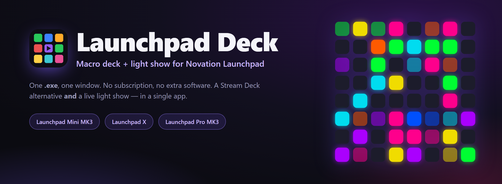
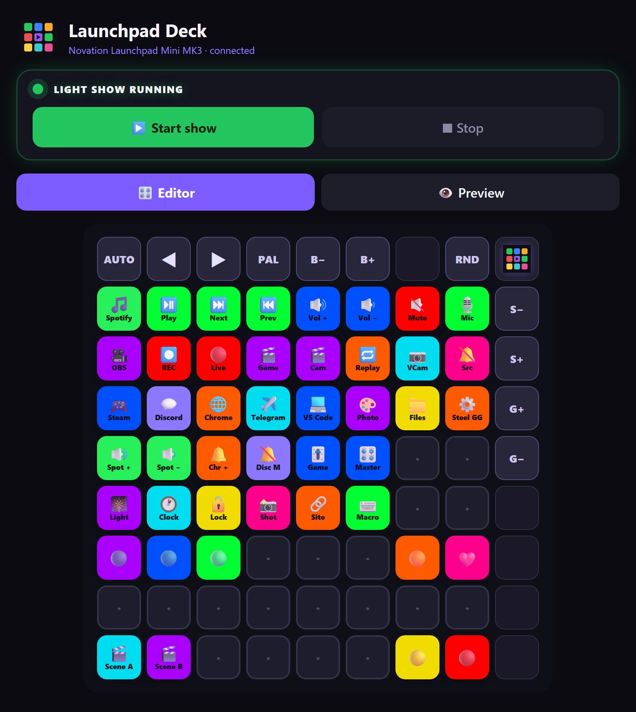
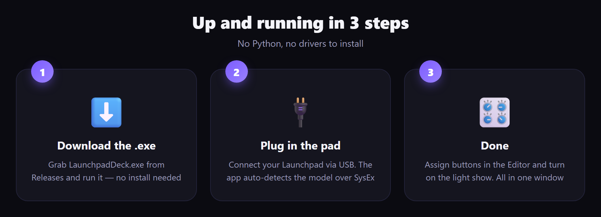
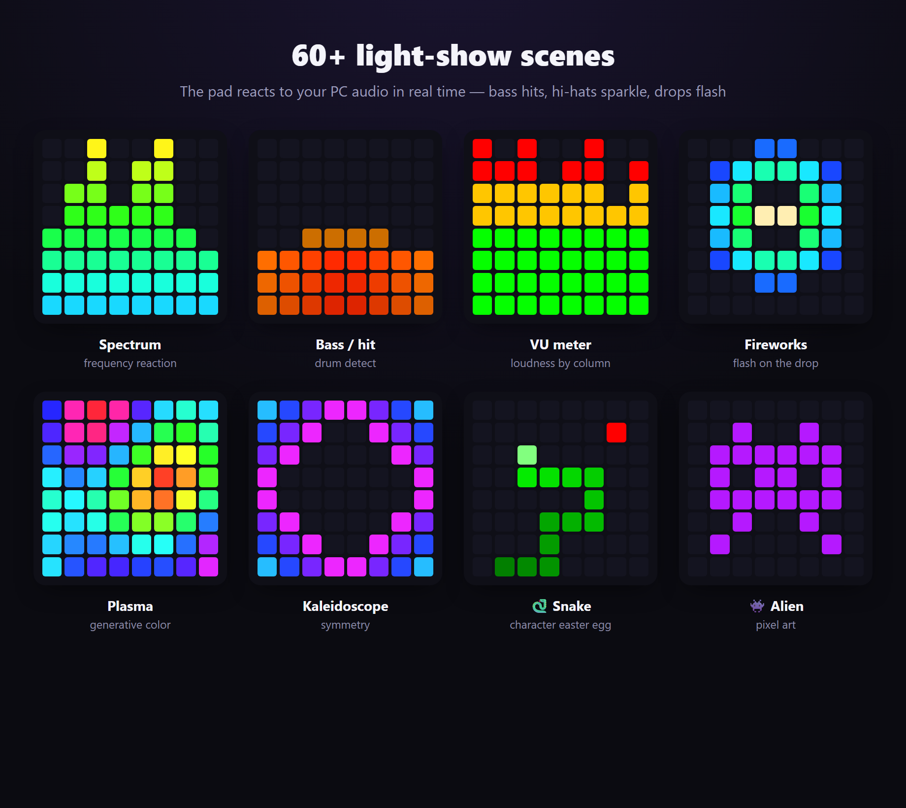
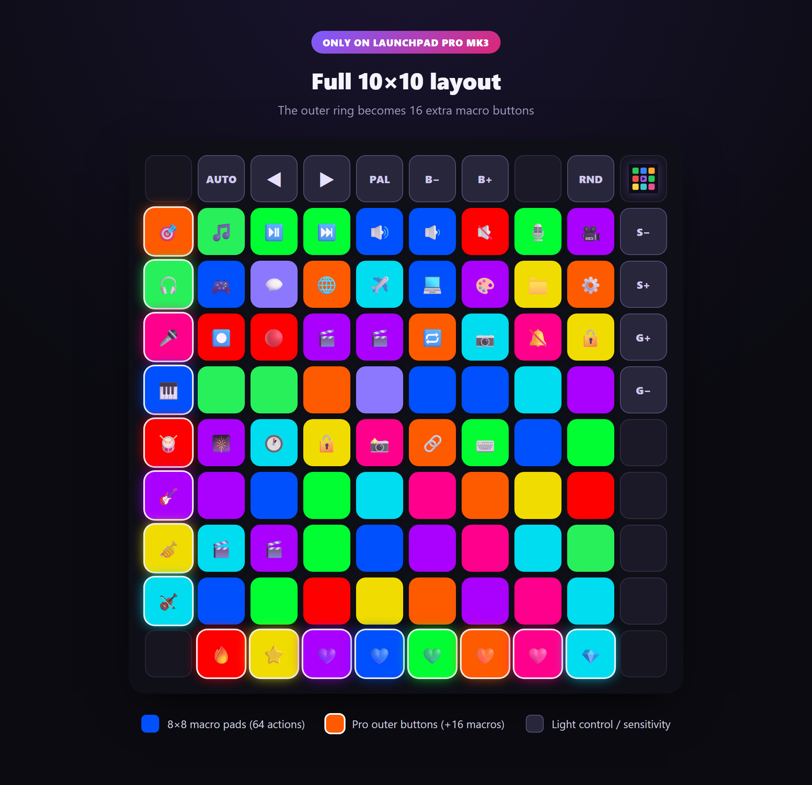

<div align="center">



<h1>Launchpad&nbsp;Deck</h1>

**Turn your Novation Launchpad into a macro deck _and_ an audio-reactive light show — in one app.**

<br>

[](../../releases/latest)
[](../../releases/latest)
[](../../releases)
[](../../stargazers)
[](#-build-from-source)
[](https://t.me/universemusicrecords)
[](#-author--rights)

[Русский](README.md) · 🌍 **English** · [Українська](README.uk.md) · [Deutsch](README.de.md) · [Español](README.es.md) · [Français](README.fr.md)

`Novation Launchpad` · `Stream Deck alternative` · `macro deck` · `MIDI controller` · `audio-reactive light show` · `Launchpad Mini MK3` · `Launchpad X` · `Launchpad Pro MK3`

<br>

### [⬇️&nbsp;&nbsp;Download LaunchpadDeck.exe&nbsp;&nbsp;→](../../releases/latest)

<br>



</div>

---

## 📖 Contents

- [✨ What it is](#-what-it-is)
- [🚀 Quick start](#-quick-start)
- [🎛 Features](#-features)
- [🎆 Light show](#-light-show)
- [🎹 Supported devices](#-supported-devices)
- [🧩 Actions & parameters](#-actions--parameters)
- [💡 Example layouts](#-example-layouts)
- [🎥 OBS setup](#-obs-setup)
- [🗂 Profiles, languages, autostart](#-profiles-languages-autostart)
- [❓ FAQ & troubleshooting](#-faq--troubleshooting)
- [🛠 Build from source](#-build-from-source)
- [👤 Author & rights](#-author--rights)

---

## ✨ What it is

**Launchpad Deck** turns your Novation light pad into two things at once:

- 🎛 **Macro deck** (like a Stream Deck) — map pads to launch apps, media & volume, mic mute (works in Discord), lock PC, hotkeys, **OBS Studio & Streamlabs** control and much more.
- 🎆 **Light show** — the pad reacts to your PC audio: bass hits, hi-hats sparkle, drops flash. **69** scenes with animations and characters, and the side buttons glow to the beat too.

All in one window, one `.exe` — **no** need to install Python or libraries. No subscription. No cloud. Works offline.

---

## 🚀 Quick start

<div align="center">



</div>

1. Download **[`LaunchpadDeck.exe`](../../releases/latest)** — no installation required.
2. Plug your Launchpad in via USB.
3. Run it — the app finds the pad and its model by itself. **Done.**

> 💡 The first launch may take a few seconds (unpacking). Windows 10/11.

---

## 🎛 Features

### 🎛 Macro deck
- Program **every pad**: launch apps, media (play/pause/track), volume — **master and per-app** (`spotify:up`, `discord:mute`, `chrome:set:30`), **system mic mute** (silences everywhere, including Discord), **lock PC**, screenshot, run a file/site, **open several apps with one button**, a live **clock** right on the pad, or just a color.
- 🎥 **OBS Studio & Streamlabs Desktop** — switch scene (by number or name), start/stop recording, go live, mute a source, replay, virtual camera. Pick the app (Auto / OBS / Streamlabs) and a **“Test connection”** button.
- 🎛 **Ready-made profiles** out of the box — **Work**, **Games**, **Stream (OBS)**.
- Colors and labels, live press animations on the pad itself.

### 🖥 App
- **Editor ⇄ Preview** — the on-screen grid mirrors the pad in real time; the edges carry light-control buttons with descriptions.
- 🗂 **Layout profiles** — different button sets (gaming, streaming, work), switch instantly.
- 🌍 **6 languages**: Русский, English, Українська, Deutsch, Español, Français — one-button switch.
- 📥 **Minimize to tray** — closing the window hides it to the tray (off the taskbar) while the pad keeps running.
- 🔔 **Auto update check** — the app compares its version with GitHub and shows a banner with a download link; your settings survive updates.
- 🚀 **Autostart** with Windows — finds the pad and restores your last config, **and re-points itself to the new version** after an update.
- 💎 **Support the project** — tip in TON right from the app.
- 💾 Export/import layouts, a built-in **tutorial**, smooth start and close animations.

---

## 🎆 Light show

Hit **“Start show”** and the pad comes alive to your PC audio. It reacts by frequency: **bass hits, snares ring, hi-hats sparkle**, and on the drop everything **flashes**.

<div align="center">



</div>

- **69 generative modes**: spectrum, drums, hi-hats, characters (🐍 snake, 🕺 dancer, 👾 alien, 🤖 robot), fireworks, kaleidoscope, plasma, tunnels, lava, snowfall, radar, waterfall, heartbeat and more.
- **The side & top buttons continue the current mode** — they pick up the active effect’s colors along the edges (part of the show, not a static glow), while the 8×8 grid stays the main canvas. Adapts to the device: Mini uses the top row + right column, Pro lights the whole ring.
- **Separate bass and hi-hat sensitivity** + brightness — sliders in the app **and right on the pad** (right column / top row).
- **Drop detection**, a calm idle mode with easter eggs.
- **Your own effects** — a plugins folder: write a `.py` with an effect class in Python and it shows up in the scene list.

---

## 🎹 Supported devices

Auto-detected via SysEx — the app **adapts the layout** to the connected model.

| Device | Grid | What you get |
|---|---|---|
| **Launchpad Mini MK3** | 8×8 + top row + right column | 64 macro pads, light show, on-pad light control |
| **Launchpad X** | 8×8 + top row + right column | same as Mini MK3 |
| **Launchpad Pro MK3** | **full 10×10** | 8×8 + **left column and bottom row as extra macro buttons** (+16 actions), light control via the top row / right column |

<div align="center">



</div>

> **Pro adaptation:** the app detects the Launchpad Pro MK3 and draws the full 10×10 ring in the editor and preview. The Pro outer buttons (left column, bottom row) are assignable macros with lighting and animation, just like regular pads. Implemented per Novation’s official programmer’s reference.

---

## 🧩 Actions & parameters

Each pad can be given an action **type** and a **parameter**. Here are all the types:

| Type | What it does | Parameter (example) |
|---|---|---|
| 🎵 Media/volume | play-pause, track, sound | `playpause` · `next` · `prev` · `volup` · `voldown` · `mute` · `stop` |
| 🔊 App volume | volume of one app | `spotify:up` · `discord:mute` · `chrome:set:30` |
| 🎥 OBS / Streamlabs | control OBS Studio or Streamlabs | `scene:1` · `scene:Game` · `record` · `stream` · `mute:Mic/Aux` · `replay` · `virtualcam` |
| 🎙 Mic / Sound | system mic mute | — |
| 🎆 Light show | toggle the show | — |
| 🕐 Clock | time scrolling on the pad | — |
| 🔒 Lock PC | lock Windows | — |
| 🗂 App list | open several at once | `steam;spotify;telegram;chrome;discord` |
| 🚀 Open app | launch an application | `spotify` · `discord` · `chrome` · `telegram` · `steam` |
| ⌨️ Hotkey | key combination | `ctrl+shift+alt+d` |
| 📁 Run file | path to .exe / document | `C:\Games\game.exe` |
| 🔗 Open site | link | `https://youtube.com` |
| 🎨 Just a color | lighting, no action | — |

<details>
<summary><b>💡 How to read it — parameter format</b></summary>

- **App volume** — `name:action`. Actions: `up`, `down`, `mute`, `set:NN` (NN in percent).
  Examples: `spotify:up` · `chrome:down` · `discord:mute` · `game:set:70`.
- **OBS** — `command` or `command:argument`. `scene:Name` switches scene; `mute:Source` mutes a source; `record` / `stream` / `pause` / `replay` / `virtualcam` are toggles.
- **App list** — names separated by `;`. Opens them all at once (great for a “stream start” button).
- **Hotkey** — modifiers `ctrl` `shift` `alt` `win` + a key, joined by `+`.
- App names (`spotify`, `discord`, `chrome`…) are resolved automatically; for your own apps use **Run file** with the full path.

</details>

---

## 💡 Example layouts

Steal the idea — assign pads like this for your scenario.

<details open>
<summary><b>🎥 For streamers</b></summary>

| Pad | Type | Parameter |
|---|---|---|
| 🔴 Go live / stop | OBS | `stream` |
| ⏺ Record | OBS | `record` |
| 🎬 “Game” scene | OBS | `scene:Game` |
| 🎬 “Camera” scene | OBS | `scene:Camera` |
| 🔁 Replay | OBS | `replay` |
| 🎙 Mic mute | Mic | — |
| 🔕 Mute “desktop audio” | OBS | `mute:Desktop Audio` |
| 🎆 Light show | Light show | — |

</details>

<details>
<summary><b>🎮 For gamers</b></summary>

| Pad | Type | Parameter |
|---|---|---|
| 🎮 Launch a game | Run file | `C:\Games\game.exe` |
| 💬 Discord | Open app | `discord` |
| 🔕 Mute in Discord | App volume | `discord:mute` |
| 🎧 Quiet Spotify | App volume | `spotify:set:30` |
| 📸 Screenshot | Screenshot | — |
| 🔒 Lock PC | Lock PC | — |
| ⌨️ Push-to-talk / macro | Hotkey | `ctrl+shift+m` |

</details>

<details>
<summary><b>💼 For work and music</b></summary>

| Pad | Type | Parameter |
|---|---|---|
| 🚀 Work set | App list | `chrome;telegram;spotify;vscode` |
| ⏯ Play/pause | Media | `playpause` |
| ⏭ Next track | Media | `next` |
| 🔊 Louder Spotify | App volume | `spotify:up` |
| 🕐 Clock on the pad | Clock | — |
| 🔗 Open mail | Open site | `https://mail.google.com` |
| 🎨 Just lighting | Just a color | — |

</details>

---

## 🎥 OBS / Streamlabs setup

**Both** apps are supported. In the app: **More → OBS / Streamlabs** — pick the app (Auto / OBS Studio / Streamlabs Desktop) and hit **“Test connection”**.

<details>
<summary><b>OBS Studio — step by step</b></summary>

1. In **OBS Studio** open **Tools → WebSocket Server Settings**.
2. Enable **Enable WebSocket server**. Default port is `4455`.
3. If authentication is on — copy the password and paste it into **Launchpad Deck → More → OBS / Streamlabs**.
4. Assign pads with the **OBS / Streamlabs** action type (see parameters below).

</details>

<details>
<summary><b>Streamlabs Desktop — step by step</b></summary>

1. Just keep **Streamlabs Desktop** running — no extra setup needed.
2. If Streamlabs runs **as administrator**, run **Launchpad Deck** as administrator too (otherwise it can’t reach it).
3. Hit **“Test connection”** — the app shows your scenes and writes a `streamlabs_report.txt` file listing your scene and audio-source names.

</details>

**Parameters (for both):** scene — `scene:1` (by number) or `scene:Name`; record — `record`, go live — `stream`; mute a source — `mute:Mic/Aux` (or `mute:1`); replay — `replay` (needs the Replay Buffer enabled); virtual camera — `virtualcam`.

> 💡 Switching scenes **by number** (`scene:1`, `scene:2`…) works regardless of your scene names.

---

## 🗂 Profiles, languages, autostart

- **Profiles** — keep separate layouts for “Stream”, “Games”, “Work” and switch instantly. Create, rename, delete, export/import — in the profiles card.
- **Languages** — 🇷🇺 🇬🇧 🇺🇦 🇩🇪 🇪🇸 🇫🇷, one-button switch; the whole UI and the tutorial are translated.
- **Autostart** — tick the box and the deck launches with Windows, finds the pad and restores the last profile. After an update it **re-points itself to the new version** you launched.
- **Tray** — closing the window minimizes it to the system tray (off the taskbar) while the deck keeps running; click the icon to bring it back.
- **Updates** — the app checks GitHub for the latest version and shows a banner when a new one is out. Settings and profiles survive updates.
- **Tutorial** — a built-in guide walks you through every feature.

---

## ❓ FAQ & troubleshooting

<details>
<summary><b>The pad isn’t detected</b></summary>

Make sure the Launchpad is connected via USB and not held by another program (Ableton, Novation Components, a browser MIDI tab). Close them and restart the deck — it reconnects on its own.
</details>

<details>
<summary><b>The light show doesn’t react to sound</b></summary>

The app listens to your **PC audio** (WASAPI loopback) — sound must be playing on the output device. Make sure your music/game plays through the same device set as Windows “default”.
</details>

<details>
<summary><b>Mic mute doesn’t work in Discord</b></summary>

Use the **Mic / Sound** type (system mute) — it mutes the microphone at the Windows level, so it works in every app, including Discord and OBS.
</details>

<details>
<summary><b>OBS won’t connect</b></summary>

Make sure the **WebSocket server** is enabled in OBS (port `4455`) and, if authentication is on, the password is pasted into the **More → OBS** card. Scene/source names must match exactly.
</details>

<details>
<summary><b>Windows SmartScreen warns on launch</b></summary>

That’s normal for new `.exe` files without paid signing. Click **“More info → Run anyway”**. The source is open — you can build it yourself (below).
</details>

---

## 🛠 Build from source

```bash
python -m venv .venv
.venv\Scripts\pip install numpy soundcard pygame pycaw comtypes pillow obsws-python pywebview pyinstaller

# Web UI (pywebview + Edge WebView2):
.venv\Scripts\pyinstaller --onefile --windowed --name LaunchpadDeck --icon deck_icon.ico ^
  --add-data "web;web" --add-data "deck_icon.ico;." --add-data "deck_icon.png;." ^
  --collect-all soundcard --collect-all pycaw --collect-all comtypes ^
  --collect-all obsws_python --collect-all websocket --collect-all webview --collect-all clr_loader ^
  --hidden-import webview.platforms.winforms --hidden-import clr app_web.py
```

Entry point — [`app_web.py`](app_web.py). Engine — [`deck.py`](deck.py) (+ [`lightshow.py`](lightshow.py), [`winmidi.py`](winmidi.py)); UI — [`web/`](web/); translations — [`i18n.py`](i18n.py).

### ⚙️ Tech notes
- The engine (audio/MIDI/light) is **Python**; the UI is **HTML/CSS/JS in Edge WebView2** via `pywebview` (GPU-rendered, smooth, no pixels). All in **one process**, one window.
- Audio capture — WASAPI loopback (`soundcard`); analysis — FFT + onset detection (`numpy`).
- Pad output — **Windows winmm** SysEx (Programmer mode); input — `pygame.midi`. Mic mute and per-app volume — Core Audio (`pycaw`). OBS — `obs-websocket`.

---

## 💜 Support

This project is free. If it helped you, you can support the author with crypto — **TON (Toncoin)**:

```
UQAK1sIJqPVn9ND8JTOEUlrBFyAiVU0j6IiiXczTM7YmX4CB
```

[**💎 Send TON →**](https://app.tonkeeper.com/transfer/UQAK1sIJqPVn9ND8JTOEUlrBFyAiVU0j6IiiXczTM7YmX4CB)

---

## 👤 Author & rights

**Author:** Daniil Oskin · **Universe Music Records**

© All rights reserved. Reworking, modifying, redistributing and updating the program — **only by arrangement with the author-developer**.

- ✈️ Telegram: **[@universemusicrecords](https://t.me/universemusicrecords)**
- ✉️ Email: **doskin50@gmail.com**

<div align="center">

<br>

**Like the project? Drop a ⭐ — it helps others find it.**

<br>

<sub>Launchpad Deck © Universe Music Records · Novation and Launchpad are trademarks of Focusrite Audio Engineering. This project is not affiliated with Novation.</sub>

</div>
