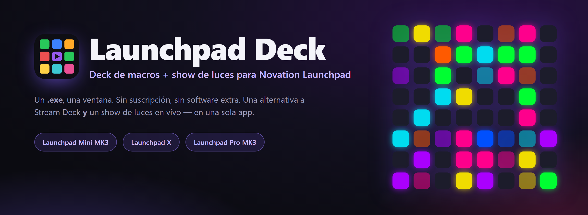
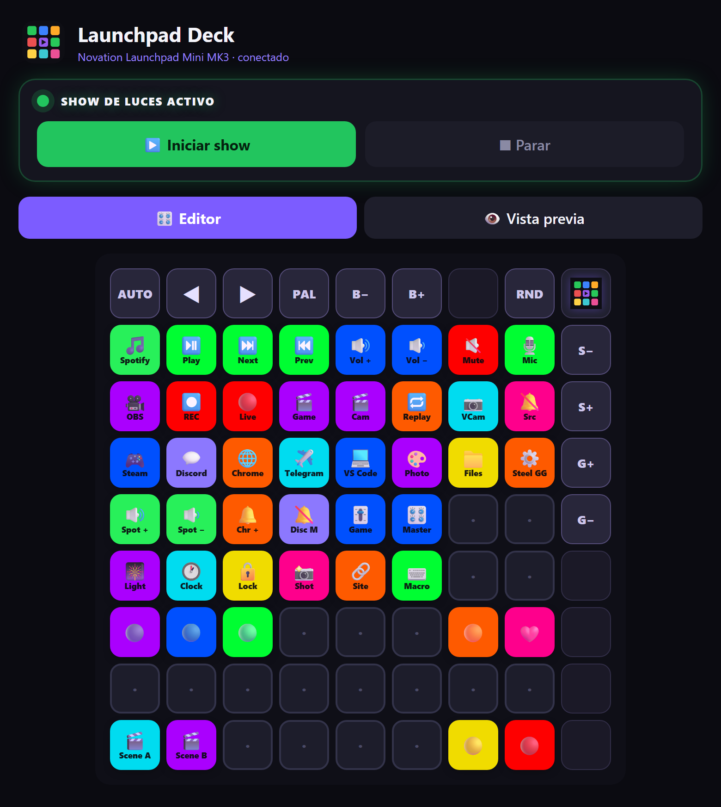
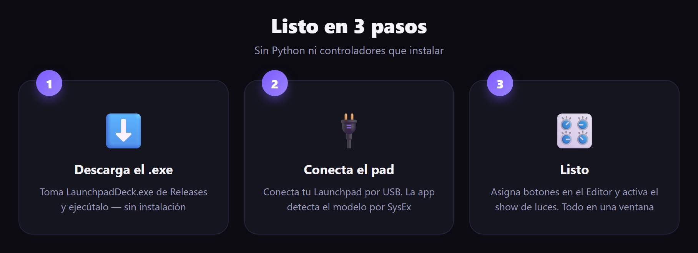
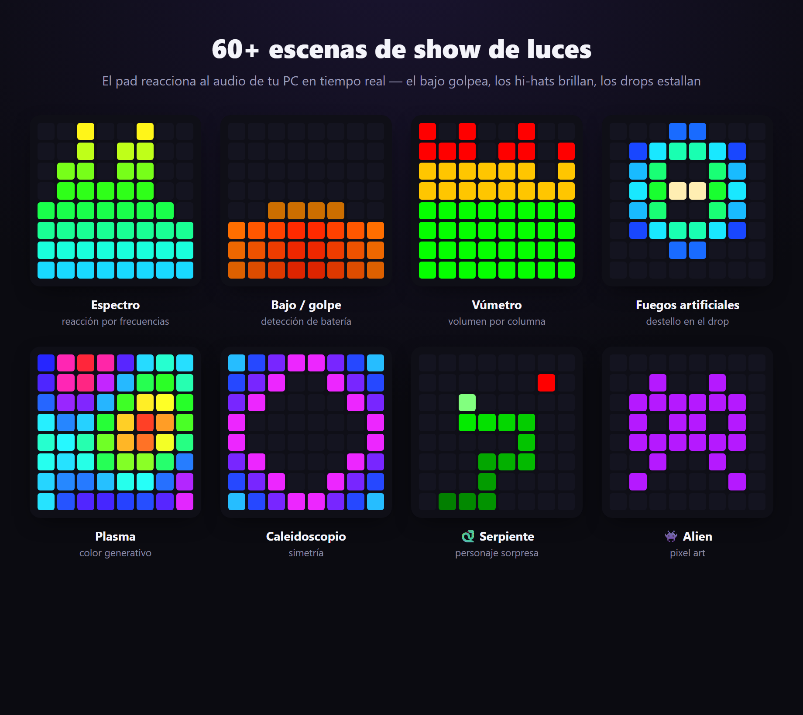
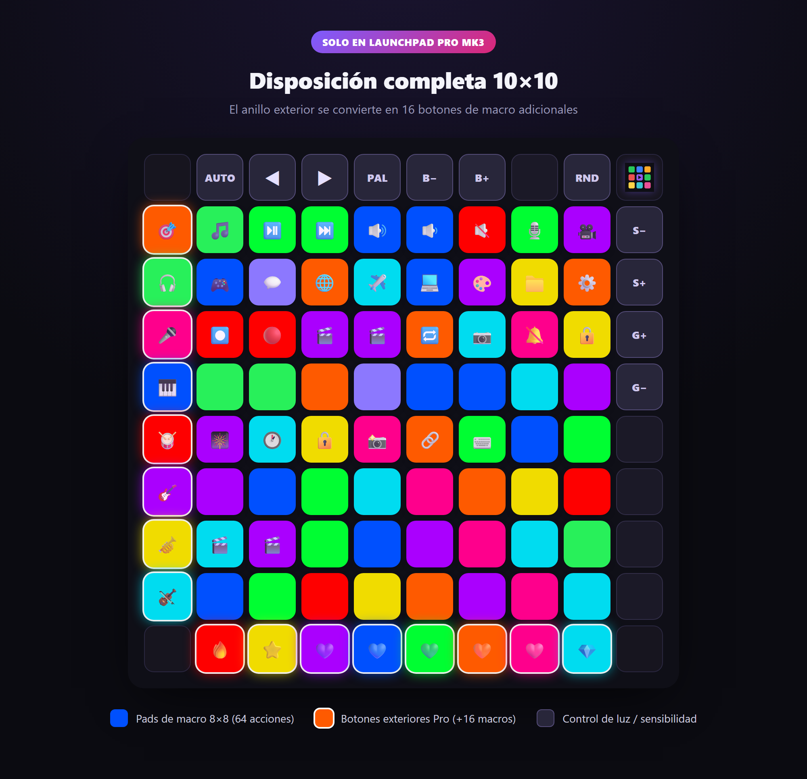

<div align="center">



<h1>Launchpad&nbsp;Deck</h1>

**Convierte tu Novation Launchpad en un deck de macros _y_ un show de luces reactivo al audio — en una sola app.**

<br>

[](../../releases/latest)
[](../../releases/latest)
[](../../releases)
[](../../stargazers)
[](#-compilar-desde-el-código)
[](https://t.me/universemusicrecords)
[](#-autor--derechos)

[Русский](README.md) · [English](README.en.md) · [Українська](README.uk.md) · [Deutsch](README.de.md) · 🌍 **Español** · [Français](README.fr.md)

`Novation Launchpad` · `Stream Deck alternative` · `macro deck` · `MIDI controller` · `audio-reactive light show` · `Launchpad Mini MK3` · `Launchpad X` · `Launchpad Pro MK3`

<br>

### [⬇️&nbsp;&nbsp;Descargar LaunchpadDeck.exe&nbsp;&nbsp;→](../../releases/latest)

<br>



</div>

---

## 📖 Contenido

- [✨ Qué es](#-qué-es)
- [🚀 Listo en 3 pasos](#-listo-en-3-pasos)
- [🎛 Funciones](#-funciones)
- [🎆 Show de luces](#-show-de-luces)
- [🎹 Dispositivos compatibles](#-dispositivos-compatibles)
- [🧩 Acciones y parámetros](#-acciones-y-parámetros)
- [💡 Disposiciones de ejemplo](#-disposiciones-de-ejemplo)
- [🎥 Configurar OBS](#-configurar-obs)
- [🗂 Perfiles, idiomas, autoarranque](#-perfiles-idiomas-autoarranque)
- [❓ Preguntas y soluciones](#-preguntas-y-soluciones)
- [🛠 Compilar desde el código](#-compilar-desde-el-código)
- [👤 Autor y derechos](#-autor--derechos)

---

## ✨ Qué es

**Launchpad Deck** convierte tu pad luminoso Novation en dos cosas a la vez:

- 🎛 **Deck de macros** (como un Stream Deck) — asigna a los botones el lanzamiento de apps, medios y volumen, silenciar el micro (funciona en Discord), bloquear el PC, atajos de teclado, control de **OBS Studio y Streamlabs** y mucho más.
- 🎆 **Show de luces** — el pad reacciona al audio del PC: el bajo golpea, los hi-hats brillan, los drops estallan. **69** escenas con animaciones y personajes, y los botones laterales también brillan al ritmo.

Todo en una ventana, un `.exe` — **no** hay que instalar Python ni librerías. Sin suscripción. Sin nube. Funciona sin conexión.

---

## 🚀 Listo en 3 pasos

<div align="center">



</div>

1. Descarga **[`LaunchpadDeck.exe`](../../releases/latest)** — no requiere instalación.
2. Conecta tu Launchpad por USB.
3. Ejecútalo — la app encuentra el pad y su modelo por sí sola. **Listo.**

> 💡 El primer arranque puede tardar unos segundos (descompresión). Windows 10/11.

---

## 🎛 Funciones

### 🎛 Deck de macros
- Programa **cada pad**: lanzar apps, medios (play/pausa/pista), volumen — **general y por app** (`spotify:up`, `discord:mute`, `chrome:set:30`), **silencio de micro del sistema** (silencia en todas partes, incluido Discord), **bloquear el PC**, captura de pantalla, abrir un archivo/sitio, **varias apps con un botón**, un **reloj** en marcha en el propio pad o simplemente un color.
- 🎥 **OBS Studio y Streamlabs Desktop** — cambiar de escena (por número o nombre), iniciar/detener grabación, salir en directo, silenciar una fuente, repetición, cámara virtual. Elige el programa (Auto / OBS / Streamlabs) y un botón **«Probar conexión»**.
- 🎛 **Perfiles listos** de fábrica — **Trabajo**, **Juegos**, **Directo (OBS)**.
- Colores y etiquetas, animaciones vivas al pulsar en el propio pad.

### 🖥 App
- **Editor ⇄ Vista previa** — la cuadrícula en pantalla refleja el pad en tiempo real; en los bordes hay botones de control de luz con descripción.
- 🗂 **Perfiles de disposición** — distintos juegos de botones (juegos, streaming, trabajo), cambio instantáneo.
- 🌍 **6 idiomas**: Русский, English, Українська, Deutsch, Español, Français — cambio con un botón.
- 📥 **Minimizar a la bandeja** — al cerrar, la ventana se oculta en la bandeja (fuera de la barra de tareas) y el pad sigue funcionando.
- 🔔 **Comprobación automática de actualizaciones** — la app compara su versión con GitHub y muestra un aviso con enlace de descarga; los ajustes se conservan al actualizar.
- 🚀 **Autoarranque** con Windows — encuentra el pad y restaura tu última configuración, **y pasa solo a la nueva versión** tras una actualización.
- 💎 **Apoyar el proyecto** — dona en TON desde la propia app.
- 💾 Exportar/importar disposiciones, **tutorial** integrado, animaciones suaves de inicio y cierre.

---

## 🎆 Show de luces

Pulsa **«Iniciar show»** y el pad cobra vida con el audio de tu PC. Reacciona por frecuencia: **el bajo golpea, las cajas suenan, los hi-hats brillan**, y en el drop todo **estalla**.

<div align="center">



</div>

- **69 modos generativos**: espectro, batería, hi-hats, personajes (🐍 serpiente, 🕺 bailarín, 👾 alien, 🤖 robot), fuegos artificiales, caleidoscopio, plasma, túneles, lava, nevada, radar, cascada, latido y más.
- **Los botones laterales y superiores continúan el modo actual** — toman los colores del efecto activo en los bordes (parte del show, no un brillo estático), y la cuadrícula 8×8 sigue siendo el lienzo principal. Se adapta al dispositivo: Mini usa la fila superior + columna derecha, Pro ilumina todo el anillo.
- **Sensibilidad separada de graves y hi-hats** + brillo — con deslizadores en la app **y desde el propio pad** (columna derecha / fila superior).
- **Detección de drops**, un modo de reposo tranquilo con sorpresas.
- **Tus propios efectos** — una carpeta de plugins: escribe un `.py` con una clase de efecto en Python y aparece en la lista de escenas.

---

## 🎹 Dispositivos compatibles

Detección automática por SysEx — la app **adapta la disposición** al modelo conectado.

| Dispositivo | Cuadrícula | Qué obtienes |
|---|---|---|
| **Launchpad Mini MK3** | 8×8 + fila superior + columna derecha | 64 pads de macro, show de luces, control de luz en el pad |
| **Launchpad X** | 8×8 + fila superior + columna derecha | igual que Mini MK3 |
| **Launchpad Pro MK3** | **10×10 completo** | 8×8 + **columna izquierda y fila inferior como botones de macro extra** (+16 acciones), control de luz por la fila superior/columna derecha |

<div align="center">



</div>

> **Adaptación a Pro:** la app detecta el Launchpad Pro MK3 y dibuja el anillo 10×10 completo en el editor y la vista previa. Los botones exteriores Pro (columna izquierda, fila inferior) son macros asignables con iluminación y animación, igual que los pads normales. Implementado según la referencia oficial de programación de Novation.

---

## 🧩 Acciones y parámetros

A cada pad se le puede dar un **tipo** de acción y un **parámetro**. Estos son todos los tipos:

| Tipo | Qué hace | Parámetro (ejemplo) |
|---|---|---|
| 🎵 Medios/volumen | play-pausa, pista, sonido | `playpause` · `next` · `prev` · `volup` · `voldown` · `mute` · `stop` |
| 🔊 Volumen de app | volumen de una app | `spotify:up` · `discord:mute` · `chrome:set:30` |
| 🎥 OBS / Streamlabs | controlar OBS Studio o Streamlabs | `scene:1` · `scene:Juego` · `record` · `stream` · `mute:Micrófono` · `replay` · `virtualcam` |
| 🎙 Micro / Sonido | silencio de micro del sistema | — |
| 🎆 Show de luces | activar/desactivar el show | — |
| 🕐 Reloj | hora en marquesina en el pad | — |
| 🔒 Bloquear PC | bloquear Windows | — |
| 🗂 Lista de apps | abrir varias a la vez | `steam;spotify;telegram;chrome;discord` |
| 🚀 Abrir app | lanzar una aplicación | `spotify` · `discord` · `chrome` · `telegram` · `steam` |
| ⌨️ Atajo | combinación de teclas | `ctrl+shift+alt+d` |
| 📁 Ejecutar archivo | ruta a .exe / documento | `C:\Games\game.exe` |
| 🔗 Abrir sitio | enlace | `https://youtube.com` |
| 🎨 Solo un color | iluminación sin acción | — |

<details>
<summary><b>💡 Cómo leerlo — formato de parámetros</b></summary>

- **Volumen de app** — `nombre:acción`. Acciones: `up`, `down`, `mute`, `set:NN` (NN en porcentaje).
  Ejemplos: `spotify:up` · `chrome:down` · `discord:mute` · `game:set:70`.
- **OBS** — `comando` o `comando:argumento`. `scene:Nombre` cambia de escena; `mute:Fuente` silencia una fuente; `record` / `stream` / `pause` / `replay` / `virtualcam` son interruptores.
- **Lista de apps** — nombres separados por `;`. Los abre todos a la vez (ideal para un botón de «inicio de stream»).
- **Atajo** — modificadores `ctrl` `shift` `alt` `win` + una tecla, unidos por `+`.
- Los nombres de apps (`spotify`, `discord`, `chrome`…) se resuelven solos; para las tuyas usa **Ejecutar archivo** con la ruta completa.

</details>

---

## 💡 Disposiciones de ejemplo

Copia la idea — asigna los pads así según tu escenario.

<details open>
<summary><b>🎥 Para streamers</b></summary>

| Pad | Tipo | Parámetro |
|---|---|---|
| 🔴 Directo on/off | OBS | `stream` |
| ⏺ Grabar | OBS | `record` |
| 🎬 Escena «Juego» | OBS | `scene:Juego` |
| 🎬 Escena «Cámara» | OBS | `scene:Cámara` |
| 🔁 Repetición | OBS | `replay` |
| 🎙 Silenciar micro | Micro | — |
| 🔕 Silenciar «audio de escritorio» | OBS | `mute:Desktop Audio` |
| 🎆 Show de luces | Show de luces | — |

</details>

<details>
<summary><b>🎮 Para gamers</b></summary>

| Pad | Tipo | Parámetro |
|---|---|---|
| 🎮 Lanzar un juego | Ejecutar archivo | `C:\Games\game.exe` |
| 💬 Discord | Abrir app | `discord` |
| 🔕 Silenciar en Discord | Volumen de app | `discord:mute` |
| 🎧 Bajar Spotify | Volumen de app | `spotify:set:30` |
| 📸 Captura de pantalla | Captura | — |
| 🔒 Bloquear PC | Bloquear PC | — |
| ⌨️ Push-to-talk / macro | Atajo | `ctrl+shift+m` |

</details>

<details>
<summary><b>💼 Para trabajo y música</b></summary>

| Pad | Tipo | Parámetro |
|---|---|---|
| 🚀 Set de trabajo | Lista de apps | `chrome;telegram;spotify;vscode` |
| ⏯ Play/pausa | Medios | `playpause` |
| ⏭ Siguiente pista | Medios | `next` |
| 🔊 Subir Spotify | Volumen de app | `spotify:up` |
| 🕐 Reloj en el pad | Reloj | — |
| 🔗 Abrir el correo | Abrir sitio | `https://mail.google.com` |
| 🎨 Solo iluminación | Solo un color | — |

</details>

---

## 🎥 Configurar OBS / Streamlabs

Se admiten **ambos** programas. En la app: **Más → OBS / Streamlabs** — elige el programa (Auto / OBS Studio / Streamlabs Desktop) y pulsa **«Probar conexión»**.

<details>
<summary><b>OBS Studio — paso a paso</b></summary>

1. En **OBS Studio** abre **Herramientas → Configuración del servidor WebSocket**.
2. Activa **«Activar servidor WebSocket»**. El puerto por defecto es `4455`.
3. Si la autenticación está activa — copia la contraseña y pégala en **Launchpad Deck → Más → OBS / Streamlabs**.
4. Asigna a los pads acciones del tipo **OBS / Streamlabs** (parámetros abajo).

</details>

<details>
<summary><b>Streamlabs Desktop — paso a paso</b></summary>

1. Solo mantén **Streamlabs Desktop** abierto — no hace falta configuración extra.
2. Si Streamlabs se ejecuta **como administrador**, ejecuta **Launchpad Deck** también como administrador.
3. Pulsa **«Probar conexión»** — la app muestra tus escenas y escribe un archivo `streamlabs_report.txt` con los nombres de tus escenas y fuentes de audio.

</details>

**Parámetros (para ambos):** escena — `scene:1` (por número) o `scene:Nombre`; grabar — `record`, directo — `stream`; silenciar una fuente — `mute:Micrófono` (o `mute:1`); repetición — `replay` (requiere el Replay Buffer activo); cámara virtual — `virtualcam`.

> 💡 Cambiar de escena **por número** (`scene:1`, `scene:2`…) funciona sin depender de los nombres de tus escenas.

---

## 🗂 Perfiles, idiomas, autoarranque

- **Perfiles** — mantén disposiciones separadas para «Stream», «Juegos», «Trabajo» y cambia al instante. Crear, renombrar, eliminar, exportar/importar — en la tarjeta de perfiles.
- **Idiomas** — 🇷🇺 🇬🇧 🇺🇦 🇩🇪 🇪🇸 🇫🇷, cambio con un botón; toda la interfaz y el tutorial están traducidos.
- **Autoarranque** — marca la casilla y el deck arranca con Windows, encuentra el pad y restaura el último perfil. Tras una actualización, el autoarranque **pasa solo a la nueva versión** que ejecutaste.
- **Bandeja** — al cerrar, la ventana se minimiza a la bandeja del sistema (fuera de la barra de tareas) y el deck sigue funcionando; haz clic en el icono para recuperarla.
- **Actualizaciones** — la app comprueba en GitHub la última versión y muestra un aviso cuando hay una nueva. Los ajustes y perfiles se conservan.
- **Tutorial** — una guía integrada te lleva por todas las funciones.

---

## ❓ Preguntas y soluciones

<details>
<summary><b>No se detecta el pad</b></summary>

Comprueba que el Launchpad esté conectado por USB y que no lo tenga otro programa (Ableton, Novation Components, una pestaña MIDI del navegador). Ciérralos y reinicia el deck — se reconecta solo.
</details>

<details>
<summary><b>El show de luces no reacciona al sonido</b></summary>

La app escucha el **audio del PC** (loopback WASAPI) — debe estar sonando algo en el dispositivo de salida. Asegúrate de que la música/juego suene por el mismo dispositivo marcado como «predeterminado» en Windows.
</details>

<details>
<summary><b>El silencio de micro no funciona en Discord</b></summary>

Usa el tipo **Micro / Sonido** (silencio del sistema) — silencia el micrófono a nivel de Windows, así que funciona en todas las apps, incluidos Discord y OBS.
</details>

<details>
<summary><b>OBS no se conecta</b></summary>

Asegúrate de que el **WebSocket server** esté activo en OBS (puerto `4455`) y, si la autenticación está activada, de que la contraseña esté pegada en la tarjeta **Más → OBS**. Los nombres de escenas/fuentes deben coincidir exactamente.
</details>

<details>
<summary><b>Windows SmartScreen avisa al iniciar</b></summary>

Es lo normal para `.exe` nuevos sin firma de pago. Pulsa **«Más información → Ejecutar de todas formas»**. El código es abierto — puedes compilarlo tú (abajo).
</details>

---

## 🛠 Compilar desde el código

```bash
python -m venv .venv
.venv\Scripts\pip install numpy soundcard pygame pycaw comtypes pillow obsws-python pywebview pyinstaller

# Web UI (pywebview + Edge WebView2):
.venv\Scripts\pyinstaller --onefile --windowed --name LaunchpadDeck --icon deck_icon.ico ^
  --add-data "web;web" --add-data "deck_icon.ico;." --add-data "deck_icon.png;." ^
  --collect-all soundcard --collect-all pycaw --collect-all comtypes ^
  --collect-all obsws_python --collect-all websocket --collect-all webview --collect-all clr_loader ^
  --hidden-import webview.platforms.winforms --hidden-import clr app_web.py
```

Punto de entrada — [`app_web.py`](app_web.py). Motor — [`deck.py`](deck.py) (+ [`lightshow.py`](lightshow.py), [`winmidi.py`](winmidi.py)); interfaz — [`web/`](web/); traducciones — [`i18n.py`](i18n.py).

### ⚙️ Notas técnicas
- El motor (audio/MIDI/luz) es **Python**; la interfaz es **HTML/CSS/JS en Edge WebView2** vía `pywebview` (renderizado por GPU, fluido, sin píxeles). Todo en **un proceso**, una ventana.
- Captura de audio — loopback WASAPI (`soundcard`); análisis — FFT + detección de onsets (`numpy`).
- Salida al pad — **Windows winmm** SysEx (modo Programmer); entrada — `pygame.midi`. Silencio de micro y volumen por app — Core Audio (`pycaw`). OBS — `obs-websocket`.

---

## 💜 Apoyar el proyecto

El proyecto es gratis. Si te ha servido, puedes apoyar al autor con cripto — **TON (Toncoin)**:

```
UQAK1sIJqPVn9ND8JTOEUlrBFyAiVU0j6IiiXczTM7YmX4CB
```

[**💎 Enviar TON →**](https://app.tonkeeper.com/transfer/UQAK1sIJqPVn9ND8JTOEUlrBFyAiVU0j6IiiXczTM7YmX4CB)

---

## 👤 Autor y derechos

**Autor:** Daniil Oskin · **Universe Music Records**

© Todos los derechos reservados. La modificación, alteración, distribución y actualización del programa — **solo mediante acuerdo con el autor-desarrollador**.

- ✈️ Telegram: **[@universemusicrecords](https://t.me/universemusicrecords)**
- ✉️ Email: **doskin50@gmail.com**

<div align="center">

<br>

**¿Te gusta el proyecto? Deja una ⭐ — ayuda a que otros lo encuentren.**

<br>

<sub>Launchpad Deck © Universe Music Records · Novation y Launchpad son marcas de Focusrite Audio Engineering. Este proyecto no está afiliado a Novation.</sub>

</div>
