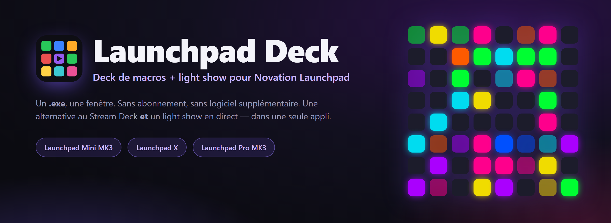
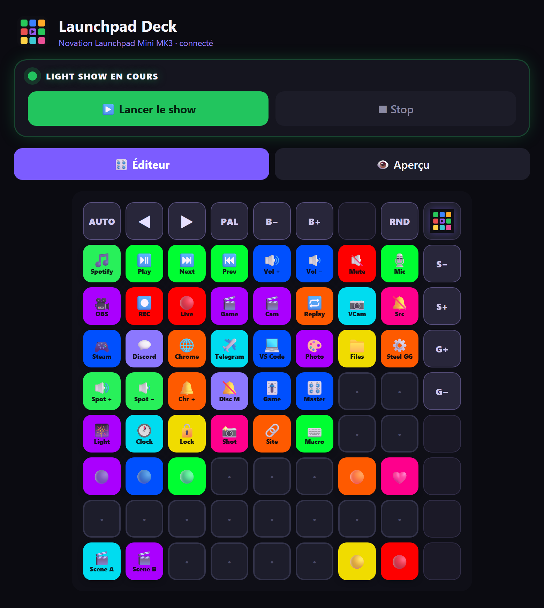
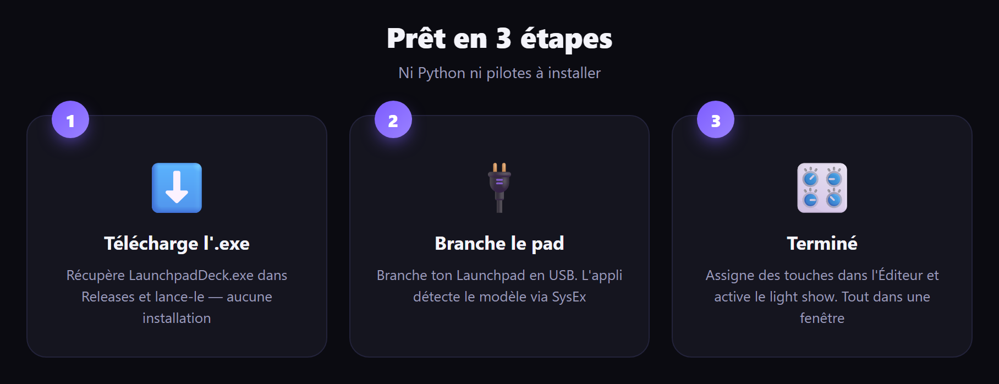
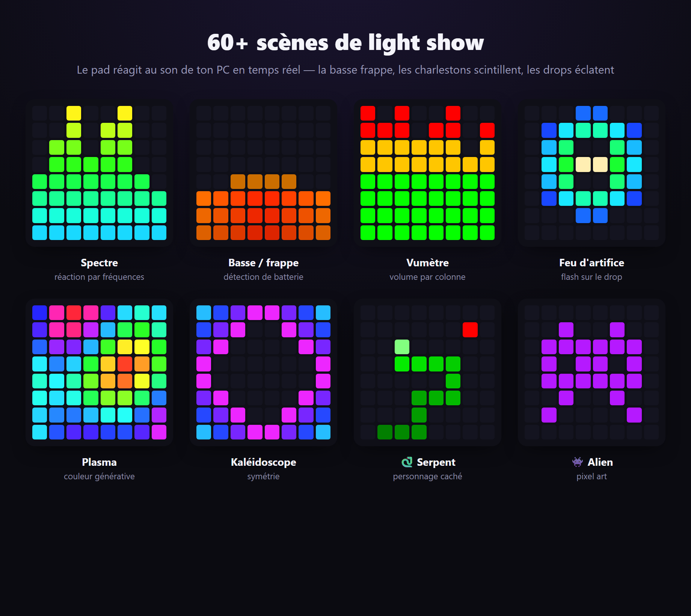
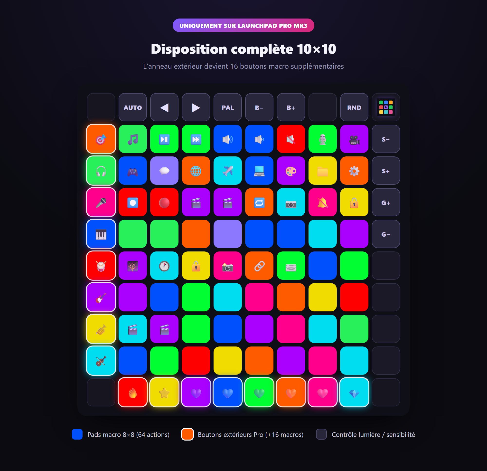

<div align="center">



<h1>Launchpad&nbsp;Deck</h1>

**Transforme ton Novation Launchpad en deck de macros _et_ en light show réactif à l’audio — dans une seule appli.**

<br>

[](../../releases/latest)
[](../../releases/latest)
[](../../releases)
[](../../stargazers)
[](#-compiler-depuis-les-sources)
[](https://t.me/universemusicrecords)
[](#-auteur--droits)

[Русский](README.md) · [English](README.en.md) · [Українська](README.uk.md) · [Deutsch](README.de.md) · [Español](README.es.md) · 🌍 **Français**

`Novation Launchpad` · `Stream Deck alternative` · `macro deck` · `MIDI controller` · `audio-reactive light show` · `Launchpad Mini MK3` · `Launchpad X` · `Launchpad Pro MK3`

<br>

### [⬇️&nbsp;&nbsp;Télécharger LaunchpadDeck.exe&nbsp;&nbsp;→](../../releases/latest)

<br>



</div>

---

## 📖 Sommaire

- [✨ Qu’est-ce que c’est](#-quest-ce-que-cest)
- [🚀 Prêt en 3 étapes](#-prêt-en-3-étapes)
- [🎛 Fonctionnalités](#-fonctionnalités)
- [🎆 Light show](#-light-show)
- [🎹 Appareils pris en charge](#-appareils-pris-en-charge)
- [🧩 Actions & paramètres](#-actions--paramètres)
- [💡 Exemples de dispositions](#-exemples-de-dispositions)
- [🎥 Configurer OBS](#-configurer-obs)
- [🗂 Profils, langues, démarrage auto](#-profils-langues-démarrage-auto)
- [❓ Questions & dépannage](#-questions--dépannage)
- [🛠 Compiler depuis les sources](#-compiler-depuis-les-sources)
- [👤 Auteur & droits](#-auteur--droits)

---

## ✨ Qu’est-ce que c’est

**Launchpad Deck** transforme ton pad lumineux Novation en deux choses à la fois :

- 🎛 **Deck de macros** (comme un Stream Deck) — assigne aux touches le lancement d’applis, les médias et le volume, couper le micro (fonctionne dans Discord), verrouiller le PC, des raccourcis clavier, le contrôle d’**OBS** et bien plus.
- 🎆 **Light show** — le pad réagit au son du PC : la basse frappe, les charlestons scintillent, les drops éclatent. **60+** scènes avec animations et personnages.

Tout dans une fenêtre, un `.exe` — **pas besoin** d’installer Python ni de bibliothèques. Sans abonnement. Sans cloud. Fonctionne hors ligne.

---

## 🚀 Prêt en 3 étapes

<div align="center">



</div>

1. Télécharge **[`LaunchpadDeck.exe`](../../releases/latest)** — aucune installation requise.
2. Branche ton Launchpad en USB.
3. Lance-le — l’appli trouve le pad et son modèle toute seule. **Terminé.**

> 💡 Le premier lancement peut prendre quelques secondes (décompression). Windows 10/11.

---

## 🎛 Fonctionnalités

### 🎛 Deck de macros
- Programme **chaque touche** : lancer des applis, médias (lecture/pause/piste), volume — **général et par appli** (`spotify:up`, `discord:mute`, `chrome:set:30`), **coupure micro système** (coupe partout, y compris Discord), **verrouiller le PC**, capture d’écran, ouvrir un fichier/site, **plusieurs applis d’un bouton**, une **horloge** défilante à même le pad ou juste une couleur.
- 🎥 **OBS Studio** — changer de scène, démarrer/arrêter l’enregistrement, passer en direct, pause, couper une source, replay, caméra virtuelle (via obs-websocket).
- Couleurs et libellés, animations vivantes à l’appui sur le pad lui-même.

### 🖥 Appli
- **Éditeur ⇄ Aperçu** — la grille à l’écran reproduit le pad en temps réel ; sur les bords, des boutons de contrôle de lumière avec description.
- 🗂 **Profils de disposition** — différents jeux de touches (jeu, streaming, travail), bascule instantanée.
- 🌍 **6 langues** : Русский, English, Українська, Deutsch, Español, Français — d’un seul bouton.
- 🚀 **Démarrage auto** avec Windows — trouve le pad et restaure ta dernière config.
- 💾 Export/import de dispositions, **tutoriel** intégré (17 étapes), animations douces de démarrage et de fermeture.

---

## 🎆 Light show

Appuie sur **« Lancer le show »** et le pad s’anime au son de ton PC. Il réagit par fréquence : **la basse frappe, les caisses claires sonnent, les charlestons scintillent**, et sur le drop tout **s’illumine**.

<div align="center">



</div>

- **60+ modes génératifs** : spectre, batterie, charlestons, personnages (🐍 serpent, 🕺 danseur, 👾 alien, 🤖 robot), feux d’artifice, kaléidoscope, plasma, tunnels, etc.
- **Détection des drops**, un mode veille tranquille avec des clins d’œil.
- **Tes propres effets** — un dossier de plugins : écris un `.py` avec une classe d’effet en Python et il apparaît dans la liste des scènes.
- La sensibilité et la luminosité se règlent **directement depuis le pad** (colonne de droite / rangée du haut).

---

## 🎹 Appareils pris en charge

Détection automatique via SysEx — l’appli **adapte la disposition** au modèle branché.

| Appareil | Grille | Ce que tu obtiens |
|---|---|---|
| **Launchpad Mini MK3** | 8×8 + rangée du haut + colonne de droite | 64 pads de macro, light show, contrôle de lumière sur le pad |
| **Launchpad X** | 8×8 + rangée du haut + colonne de droite | comme le Mini MK3 |
| **Launchpad Pro MK3** | **10×10 complet** | 8×8 + **colonne de gauche et rangée du bas comme touches de macro supplémentaires** (+16 actions), contrôle de lumière via la rangée du haut/colonne de droite |

<div align="center">



</div>

> **Adaptation au Pro :** l’appli détecte le Launchpad Pro MK3 et dessine l’anneau 10×10 complet dans l’éditeur et l’aperçu. Les boutons extérieurs du Pro (colonne de gauche, rangée du bas) sont des macros assignables avec éclairage et animation, comme les pads normaux. Réalisé selon la référence programmeur officielle de Novation.

---

## 🧩 Actions & paramètres

À chaque pad on peut donner un **type** d’action et un **paramètre**. Voici tous les types :

| Type | Ce que ça fait | Paramètre (exemple) |
|---|---|---|
| 🎵 Médias/volume | lecture-pause, piste, son | `playpause` · `next` · `prev` · `volup` · `voldown` · `mute` · `stop` |
| 🔊 Volume d’appli | volume d’une appli | `spotify:up` · `discord:mute` · `chrome:set:30` |
| 🎥 OBS Studio | contrôler OBS | `scene:Jeu` · `record` · `stream` · `mute:Micro` · `replay` · `virtualcam` |
| 🎙 Micro / Son | coupure micro système | — |
| 🎆 Light show | activer/désactiver le show | — |
| 🕐 Horloge | heure défilante sur le pad | — |
| 🔒 Verrouiller le PC | verrouiller Windows | — |
| 🗂 Liste d’applis | en ouvrir plusieurs d’un coup | `steam;spotify;telegram;chrome;discord` |
| 🚀 Ouvrir une appli | lancer une application | `spotify` · `discord` · `chrome` · `telegram` · `steam` |
| ⌨️ Raccourci | combinaison de touches | `ctrl+shift+alt+d` |
| 📁 Lancer un fichier | chemin vers .exe / document | `C:\Games\game.exe` |
| 🔗 Ouvrir un site | lien | `https://youtube.com` |
| 🎨 Juste une couleur | éclairage sans action | — |

<details>
<summary><b>💡 Comment lire — format des paramètres</b></summary>

- **Volume d’appli** — `nom:action`. Actions : `up`, `down`, `mute`, `set:NN` (NN en pourcent).
  Exemples : `spotify:up` · `chrome:down` · `discord:mute` · `game:set:70`.
- **OBS** — `commande` ou `commande:argument`. `scene:Nom` change de scène ; `mute:Source` coupe une source ; `record` / `stream` / `pause` / `replay` / `virtualcam` sont des bascules.
- **Liste d’applis** — noms séparés par `;`. Les ouvre tous d’un coup (parfait pour un bouton « démarrage de stream »).
- **Raccourci** — modificateurs `ctrl` `shift` `alt` `win` + une touche, reliés par `+`.
- Les noms d’applis (`spotify`, `discord`, `chrome`…) sont résolus automatiquement ; pour les tiennes, utilise **Lancer un fichier** avec le chemin complet.

</details>

---

## 💡 Exemples de dispositions

Reprends l’idée — assigne les pads ainsi selon ton scénario.

<details open>
<summary><b>🎥 Pour les streamers</b></summary>

| Pad | Type | Paramètre |
|---|---|---|
| 🔴 Direct on/off | OBS | `stream` |
| ⏺ Enregistrer | OBS | `record` |
| 🎬 Scène « Jeu » | OBS | `scene:Jeu` |
| 🎬 Scène « Caméra » | OBS | `scene:Caméra` |
| 🔁 Replay | OBS | `replay` |
| 🎙 Couper le micro | Micro | — |
| 🔕 Couper « audio du bureau » | OBS | `mute:Desktop Audio` |
| 🎆 Light show | Light show | — |

</details>

<details>
<summary><b>🎮 Pour les joueurs</b></summary>

| Pad | Type | Paramètre |
|---|---|---|
| 🎮 Lancer un jeu | Lancer un fichier | `C:\Games\game.exe` |
| 💬 Discord | Ouvrir une appli | `discord` |
| 🔕 Couper dans Discord | Volume d’appli | `discord:mute` |
| 🎧 Baisser Spotify | Volume d’appli | `spotify:set:30` |
| 📸 Capture d’écran | Capture | — |
| 🔒 Verrouiller le PC | Verrouiller le PC | — |
| ⌨️ Push-to-talk / macro | Raccourci | `ctrl+shift+m` |

</details>

<details>
<summary><b>💼 Pour le travail et la musique</b></summary>

| Pad | Type | Paramètre |
|---|---|---|
| 🚀 Set de travail | Liste d’applis | `chrome;telegram;spotify;vscode` |
| ⏯ Lecture/pause | Médias | `playpause` |
| ⏭ Piste suivante | Médias | `next` |
| 🔊 Monter Spotify | Volume d’appli | `spotify:up` |
| 🕐 Horloge sur le pad | Horloge | — |
| 🔗 Ouvrir la messagerie | Ouvrir un site | `https://mail.google.com` |
| 🎨 Juste l’éclairage | Juste une couleur | — |

</details>

---

## 🎥 Configurer OBS

<details>
<summary><b>Pas à pas — connecter OBS au deck</b></summary>

1. Dans **OBS Studio**, ouvre **Outils → paramètres obs-websocket** (WebSocket Server Settings).
2. Active **Enable WebSocket server**. Le port par défaut est `4455`.
3. Si **Enable Authentication** est coché — copie le mot de passe (**Show Connect Info**).
4. Dans **Launchpad Deck** → la carte **Plus → OBS** — colle ce mot de passe et enregistre.
5. Assigne aux pads des actions de type **OBS Studio** :
   - changer de scène — `scene:NomExactDeScène`
   - enregistrer — `record`, direct — `stream`, pause — `pause`
   - couper une source — `mute:NomExactDeSource`
   - replay — `replay`, caméra virtuelle — `virtualcam`

> ⚠️ Les noms de scènes et de sources doivent correspondre **exactement** à ceux d’OBS (casse et espaces compris).

</details>

---

## 🗂 Profils, langues, démarrage auto

- **Profils** — garde des dispositions séparées pour « Stream », « Jeux », « Travail » et bascule instantanément. Créer, renommer, supprimer, exporter/importer — dans la carte des profils.
- **Langues** — 🇷🇺 🇬🇧 🇺🇦 🇩🇪 🇪🇸 🇫🇷, d’un seul bouton ; toute l’interface et le tutoriel sont traduits.
- **Démarrage auto** — coche la case et le deck démarre avec Windows, trouve le pad et restaure le dernier profil.
- **Tutoriel** — un guide intégré de 17 étapes te fait passer par toutes les fonctions.

---

## ❓ Questions & dépannage

<details>
<summary><b>Le pad n’est pas détecté</b></summary>

Vérifie que le Launchpad est branché en USB et qu’il n’est pas occupé par un autre programme (Ableton, Novation Components, un onglet MIDI du navigateur). Ferme-les et relance le deck — il se reconnecte tout seul.
</details>

<details>
<summary><b>Le light show ne réagit pas au son</b></summary>

L’appli écoute le **son du PC** (loopback WASAPI) — du son doit sortir sur le périphérique de sortie. Assure-toi que la musique/le jeu passe par le même périphérique défini comme « par défaut » dans Windows.
</details>

<details>
<summary><b>La coupure micro ne marche pas dans Discord</b></summary>

Utilise le type **Micro / Son** (coupure système) — il coupe le micro au niveau de Windows, donc ça marche dans toutes les applis, y compris Discord et OBS.
</details>

<details>
<summary><b>OBS ne se connecte pas</b></summary>

Vérifie que le **WebSocket server** est activé dans OBS (port `4455`) et, si l’authentification est activée, que le mot de passe est collé dans la carte **Plus → OBS**. Les noms de scènes/sources doivent correspondre à l’exact.
</details>

<details>
<summary><b>Windows SmartScreen avertit au lancement</b></summary>

C’est normal pour les nouveaux `.exe` sans signature payante. Clique sur **« Informations complémentaires → Exécuter quand même »**. Les sources sont ouvertes — tu peux compiler toi-même (ci-dessous).
</details>

---

## 🛠 Compiler depuis les sources

```bash
python -m venv .venv
.venv\Scripts\pip install numpy soundcard pygame pycaw comtypes pillow obsws-python pywebview pyinstaller

# Web UI (pywebview + Edge WebView2):
.venv\Scripts\pyinstaller --onefile --windowed --name LaunchpadDeck --icon deck_icon.ico ^
  --add-data "web;web" --add-data "deck_icon.ico;." --add-data "deck_icon.png;." ^
  --collect-all soundcard --collect-all pycaw --collect-all comtypes ^
  --collect-all obsws_python --collect-all websocket --collect-all webview --collect-all clr_loader ^
  --hidden-import webview.platforms.winforms --hidden-import clr app_web.py
```

Point d’entrée — [`app_web.py`](app_web.py). Moteur — [`deck.py`](deck.py) (+ [`lightshow.py`](lightshow.py), [`winmidi.py`](winmidi.py)) ; interface — [`web/`](web/) ; traductions — [`i18n.py`](i18n.py).

### ⚙️ Notes techniques
- Le moteur (audio/MIDI/lumière) est en **Python** ; l’interface est en **HTML/CSS/JS dans Edge WebView2** via `pywebview` (rendu GPU, fluide, sans pixels). Le tout dans **un seul processus**, une fenêtre.
- Capture audio — loopback WASAPI (`soundcard`) ; analyse — FFT + détection d’onsets (`numpy`).
- Sortie vers le pad — **Windows winmm** SysEx (mode Programmer) ; entrée — `pygame.midi`. Coupure micro et volume par appli — Core Audio (`pycaw`). OBS — `obs-websocket`.

---

## 👤 Auteur & droits

**Auteur :** Daniil Oskin · **Universe Music Records**

© Tous droits réservés. La refonte, la modification, la distribution et la mise à jour du programme — **uniquement en accord avec l’auteur-développeur**.

- ✈️ Telegram : **[@universemusicrecords](https://t.me/universemusicrecords)**
- ✉️ E-mail : **doskin50@gmail.com**

<div align="center">

<br>

**Le projet te plaît ? Laisse une ⭐ — ça aide les autres à le trouver.**

<br>

<sub>Launchpad Deck © Universe Music Records · Novation et Launchpad sont des marques de Focusrite Audio Engineering. Ce projet n’est pas affilié à Novation.</sub>

</div>
