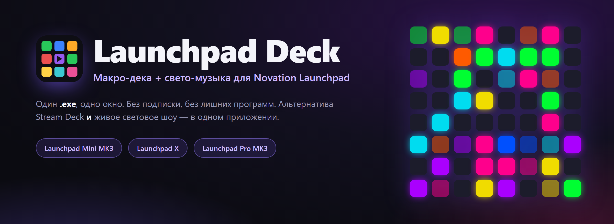
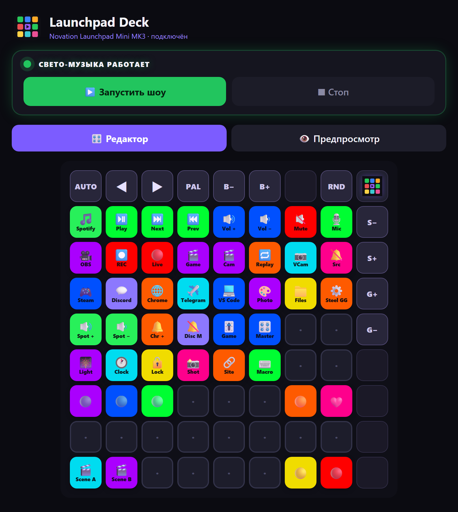
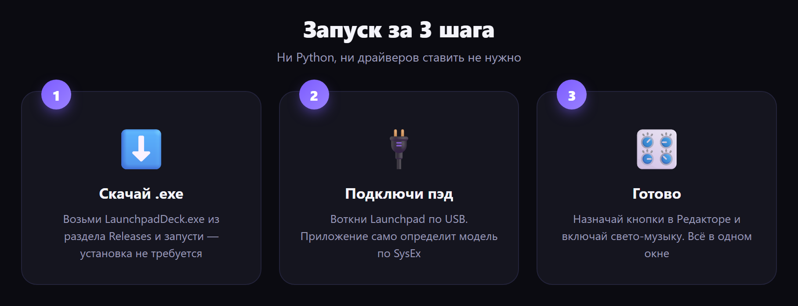
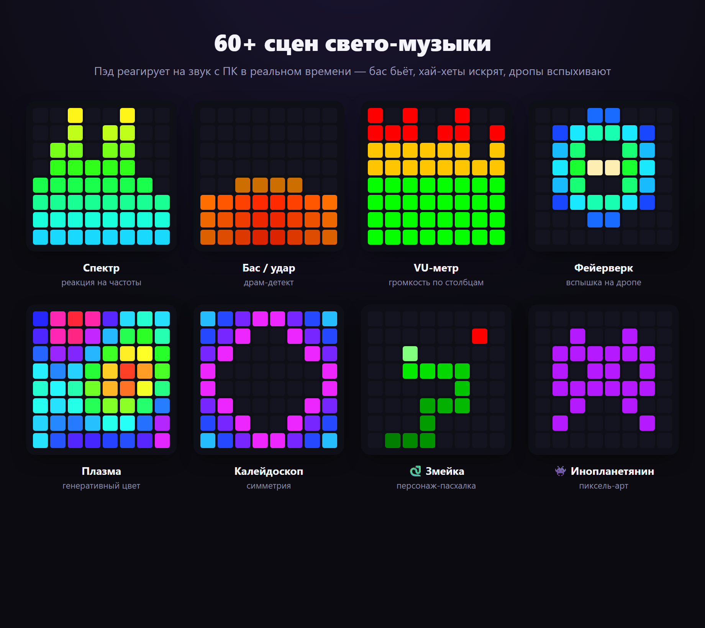
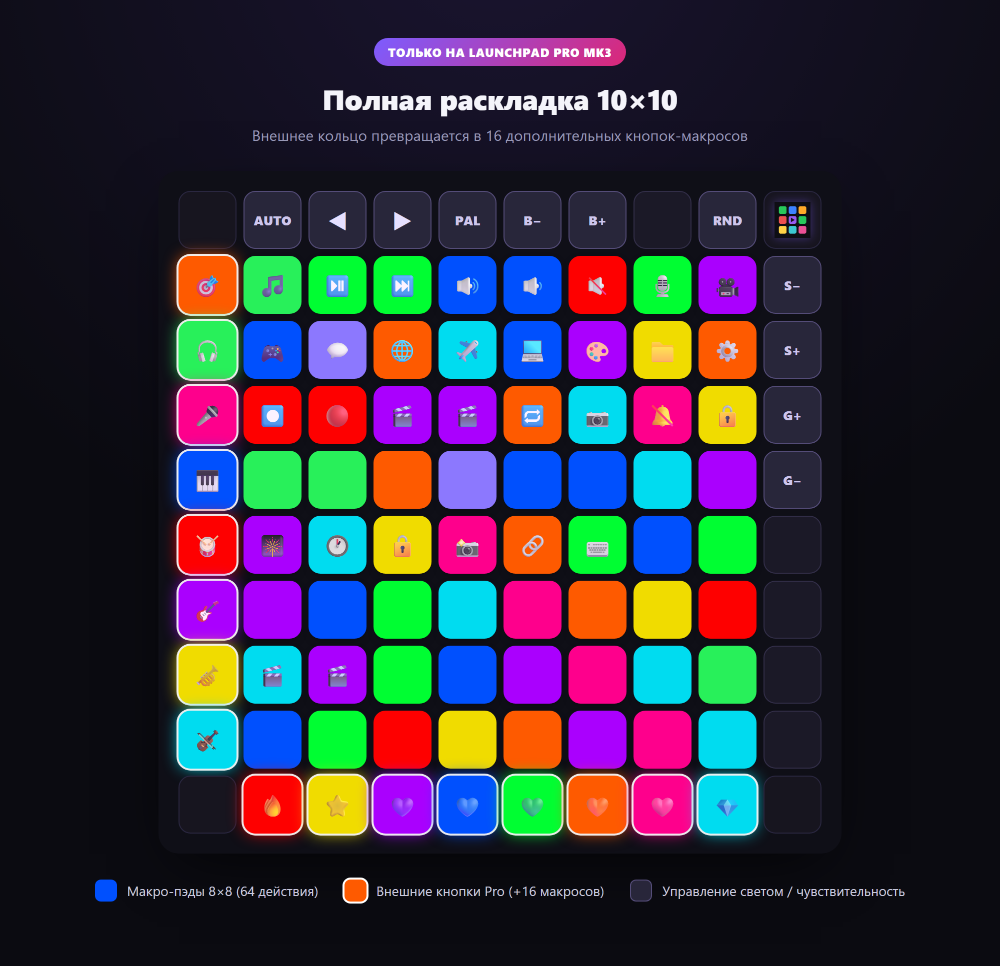

<div align="center">



<h1>Launchpad&nbsp;Deck</h1>

**Преврати свой Novation Launchpad в макро-деку _и_ свето-музыку — в одном приложении.**
**Turn your Novation Launchpad into a macro deck _and_ an audio-reactive light show — in one app.**

<br>

[](../../releases/latest)
[](../../releases/latest)
[](../../releases)
[](../../stargazers)
[](#-сборка-из-исходников--build-from-source)
[](https://t.me/universemusicrecords)
[](#-автор-и-права--author--rights)

🌍 **Русский** · [English](README.en.md) · [Українська](README.uk.md) · [Deutsch](README.de.md) · [Español](README.es.md) · [Français](README.fr.md)

`Novation Launchpad` · `Stream Deck alternative` · `macro deck` · `MIDI controller` · `audio-reactive light show` · `Launchpad Mini MK3` · `Launchpad X` · `Launchpad Pro MK3`

<br>

### [⬇️&nbsp;&nbsp;Скачать LaunchpadDeck.exe&nbsp;&nbsp;→](../../releases/latest)

<br>



</div>

---

## 📖 Содержание

- [✨ Что это](#-что-это--what-it-is)
- [🚀 Запуск за 3 шага](#-запуск-за-3-шага--quick-start)
- [🎛 Возможности](#-возможности--features)
- [🎆 Свето-музыка](#-свето-музыка--light-show)
- [🎹 Поддерживаемые устройства](#-поддерживаемые-устройства--supported-devices)
- [🧩 Типы действий и параметры](#-типы-действий-и-параметры--actions--parameters)
- [💡 Готовые примеры раскладок](#-готовые-примеры-раскладок--example-layouts)
- [🎥 Настройка OBS](#-настройка-obs--obs-setup)
- [🗂 Профили, языки, автозапуск](#-профили-языки-автозапуск--more)
- [❓ Вопросы и решения](#-вопросы-и-решения--faq--troubleshooting)
- [🛠 Сборка из исходников](#-сборка-из-исходников--build-from-source)
- [👤 Автор и права](#-автор-и-права--author--rights)

---

## ✨ Что это / What it is

**Launchpad Deck** делает из светового пэда Novation две вещи сразу:

- 🎛 **Макро-дека** (как Stream Deck) — назначай на кнопки запуск программ, медиа и громкость, мут микрофона (работает в Discord), блокировку ПК, часы, горячие клавиши, управление **OBS Studio и Streamlabs** и многое другое.
- 🎆 **Свето-музыка** — пэд реагирует на звук с ПК: бас бьёт, хай-хеты искрят, дропы вспыхивают. **69** сцен с анимациями и персонажами, а боковые кнопки тоже светятся в такт.

Всё в одном окне, в одном `.exe` — Python и библиотеки ставить **не нужно**. Без подписки. Без облака. Работает офлайн.

---

## 🚀 Запуск за 3 шага / Quick start

<div align="center">



</div>

1. Скачай **[`LaunchpadDeck.exe`](../../releases/latest)** — установка не требуется.
2. Подключи Launchpad по USB.
3. Запусти — приложение само найдёт пэд и модель. **Готово.**

> 💡 Первый запуск может занять несколько секунд (распаковка). Windows 10/11.

---

## 🎛 Возможности / Features

### 🎛 Макро-дека
- Программируй **каждый пэд**: запуск программ, медиа (плей/пауза/трек), громкость — **общая и по приложениям** (`spotify:up`, `discord:mute`, `chrome:set:30`), **системный мут микрофона** (глушит везде, включая Discord), **блокировка ПК**, скриншот, запуск файла/сайта, **список программ одной кнопкой**, бегущие **часы** прямо на пэде или просто цвет.
- 🎥 **OBS Studio и Streamlabs Desktop** — смена сцены (по номеру или имени), старт/стоп записи, эфир, мут источника, повтор, вирт-камера. Выбор программы (Авто / OBS / Streamlabs) и кнопка **«Проверить подключение»**.
- 🎛 **Готовые профили** из коробки — **Работа**, **Игры**, **Стрим (OBS)** — бери и пользуйся.
- Цветовое оформление и подписи, живые анимации при нажатии на самом пэде.

### 🖥 Приложение
- **Редактор ⇄ Предпросмотр** — сетка на экране повторяет пэд в реальном времени; по краям — кнопки управления светом с описанием.
- 🗂 **Профили раскладки** — разные наборы кнопок (игры, стрим, работа), переключение мгновенно.
- 🌍 **6 языков**: Русский, English, Українська, Deutsch, Español, Français — переключаются одной кнопкой.
- 📥 **Сворачивание в трей** — при закрытии окно прячется в трей (пропадает с панели задач), а пэд продолжает работать.
- 🔔 **Авто-проверка обновлений** — приложение само сверяет версию с GitHub и показывает баннер со ссылкой на скачивание; настройки при обновлении не теряются.
- 🚀 **Автозапуск** с Windows — сам находит пэд и поднимает последний конфиг, **и сам переключается на новую версию** после обновления.
- 💎 **Поддержка проекта** — донат в TON прямо из приложения.
- 💾 Экспорт/импорт раскладки, встроенное **обучение**, плавные анимации запуска и закрытия.

---

## 🎆 Свето-музыка / Light show

Нажми **«Запустить шоу»** — и пэд оживает под звук с твоего ПК. Реакция идёт по частотам: **бас бьёт, снейры звенят, хай-хеты искрят**, а на дропе всё **вспыхивает**.

<div align="center">



</div>

- **69 генеративных режимов**: спектр, барабаны, хай-хеты, персонажи (🐍 змейка, 🕺 танцор, 👾 инопланетянин, 🤖 робот), фейерверки, калейдоскоп, плазма, туннели, лава, снегопад, радар, водопад, сердцебиение и др.
- **Боковые и верхние кнопки продолжают текущий режим** — они подхватывают цвета активного эффекта по краям (не статичная подсветка, а часть шоу), а основа остаётся на сетке 8×8. Подстраивается под устройство: Mini — верх и правый столбец, Pro — всё кольцо.
- **Раздельная чувствительность баса и хай-хетов** + яркость — регулируются ползунками в приложении **и прямо с пэда** (правый столбец / верхний ряд).
- **Детект дропов**, спокойный idle-режим с пасхалками.
- **Свои эффекты** — папка плагинов: пишешь `.py` с классом-эффектом на Python, и он появляется в списке сцен.

---

## 🎹 Поддерживаемые устройства / Supported devices

Автоопределение по SysEx — приложение **само подстраивает раскладку** под подключённую модель.

| Устройство | Сетка | Что даёт |
|---|---|---|
| **Launchpad Mini MK3** | 8×8 + верхний ряд + правый столбец | 64 макро-пэда, свето-музыка, управление светом на паде |
| **Launchpad X** | 8×8 + верхний ряд + правый столбец | то же, что Mini MK3 |
| **Launchpad Pro MK3** | **полная 10×10** | 8×8 + **левый столбец и нижний ряд как доп. макро-кнопки** (+16 действий), управление светом верхним рядом/правым столбцом |

<div align="center">



</div>

> **Адаптация под Pro:** программа определяет Launchpad Pro MK3 и рисует полное кольцо 10×10 в редакторе и предпросмотре. Внешние кнопки Pro (левый столбец, нижний ряд) — назначаемые макросы с подсветкой и анимацией, как обычные пэды. Реализовано по официальному программерскому референсу Novation.

---

## 🧩 Типы действий и параметры / Actions & parameters

Каждому пэду можно задать **тип** действия и **параметр**. Вот все типы:

| Тип | Что делает | Параметр (пример) |
|---|---|---|
| 🎵 Медиа/громкость | плей-пауза, трек, звук | `playpause` · `next` · `prev` · `volup` · `voldown` · `mute` · `stop` |
| 🔊 Громкость приложения | громкость одной проги | `spotify:up` · `discord:mute` · `chrome:set:30` |
| 🎥 OBS / Streamlabs | управление OBS Studio или Streamlabs | `scene:1` · `scene:Игра` · `record` · `stream` · `mute:Микрофон` · `replay` · `virtualcam` |
| 🎙 Микрофон / Звук | системный мут микрофона | — |
| 🎆 Свето-музыка | вкл/выкл шоу | — |
| 🕐 Часы | время бегущей строкой на пэде | — |
| 🔒 Блокировка ПК | заблокировать Windows | — |
| 🗂 Список программ | открыть несколько сразу | `steam;spotify;telegram;chrome;discord` |
| 🚀 Открыть прогу | запуск приложения | `spotify` · `discord` · `chrome` · `telegram` · `steam` |
| ⌨️ Горячая клавиша | комбинация клавиш | `ctrl+shift+alt+d` |
| 📁 Запустить файл | путь к .exe / документу | `C:\Games\game.exe` |
| 🔗 Открыть сайт | ссылка | `https://youtube.com` |
| 🎨 Просто цвет | подсветка без действия | — |

<details>
<summary><b>💡 Как это читать — формат параметров</b></summary>

- **Громкость приложения** — `имя:действие`. Действия: `up`, `down`, `mute`, `set:NN` (где NN — проценты).
  Примеры: `spotify:up` · `chrome:down` · `discord:mute` · `game:set:70`.
- **OBS** — `команда` или `команда:аргумент`. `scene:Название` меняет сцену; `mute:Источник` глушит источник; `record` / `stream` / `pause` / `replay` / `virtualcam` — переключатели.
- **Список программ** — имена через `;`. Открывает все разом (удобно на «стрим-старт»).
- **Горячая клавиша** — модификаторы `ctrl` `shift` `alt` `win` + клавиша, через `+`.
- Имена программ (`spotify`, `discord`, `chrome`…) приложение находит само; для своих — используй **Запустить файл** с полным путём.

</details>

---

## 💡 Готовые примеры раскладок / Example layouts

Скопируй идею — назначь пэдам такие действия под свой сценарий.

<details open>
<summary><b>🎥 Для стримера</b></summary>

| Пэд | Тип | Параметр |
|---|---|---|
| 🔴 Эфир вкл/выкл | OBS | `stream` |
| ⏺ Запись | OBS | `record` |
| 🎬 Сцена «Игра» | OBS | `scene:Игра` |
| 🎬 Сцена «Камера» | OBS | `scene:Камера` |
| 🔁 Повтор (replay) | OBS | `replay` |
| 🎙 Мут микрофона | Микрофон | — |
| 🔕 Мут «десктоп-звук» | OBS | `mute:Desktop Audio` |
| 🎆 Свето-музыка | Свето-музыка | — |

</details>

<details>
<summary><b>🎮 Для геймера</b></summary>

| Пэд | Тип | Параметр |
|---|---|---|
| 🎮 Запустить игру | Запустить файл | `C:\Games\game.exe` |
| 💬 Discord | Открыть прогу | `discord` |
| 🔕 Мут в Discord | Громкость приложения | `discord:mute` |
| 🎧 Spotify тише | Громкость приложения | `spotify:set:30` |
| 📸 Скриншот | Скриншот | — |
| 🔒 Заблокировать ПК | Блокировка ПК | — |
| ⌨️ Пуш-ту-ток / макрос | Горячая клавиша | `ctrl+shift+m` |

</details>

<details>
<summary><b>💼 Для работы и музыки</b></summary>

| Пэд | Тип | Параметр |
|---|---|---|
| 🚀 Рабочий набор | Список программ | `chrome;telegram;spotify;vscode` |
| ⏯ Плей/пауза | Медиа | `playpause` |
| ⏭ Следующий трек | Медиа | `next` |
| 🔊 Громче Spotify | Громкость приложения | `spotify:up` |
| 🕐 Часы на пэде | Часы | — |
| 🔗 Открыть почту | Открыть сайт | `https://mail.google.com` |
| 🎨 Просто подсветка | Просто цвет | — |

</details>

---

## 🎥 Настройка OBS / Streamlabs

Поддерживаются **обе** программы. В приложении: **Ещё → OBS / Streamlabs** — выбери программу (Авто / OBS Studio / Streamlabs Desktop) и нажми **«Проверить подключение»**.

<details>
<summary><b>OBS Studio — пошагово</b></summary>

1. В **OBS Studio** открой **Инструменты → Настройки сервера WebSocket**.
2. Включи **«Включить сервер WebSocket»**. Порт по умолчанию — `4455`.
3. Если включена аутентификация — скопируй пароль и вставь его в **Launchpad Deck → Ещё → OBS / Streamlabs**.
4. Назначь пэдам действия типа **OBS / Streamlabs** (см. параметры ниже).

</details>

<details>
<summary><b>Streamlabs Desktop — пошагово</b></summary>

1. Просто держи **Streamlabs Desktop** запущенным — доп. настройка не нужна.
2. Если Streamlabs запущен **от имени администратора** — запусти **Launchpad Deck** тоже от администратора (иначе управление до него не дотянется).
3. Нажми **«Проверить подключение»** — приложение покажет твои сцены и запишет файл-отчёт `streamlabs_report.txt` с именами сцен и аудио-источников.

</details>

**Параметры (для обеих):** смена сцены — `scene:1` (по номеру) или `scene:Название`; запись — `record`, эфир — `stream`; мут источника — `mute:Микрофон` (или `mute:1`); повтор — `replay` (нужен включённый Replay Buffer); вирт-камера — `virtualcam`.

> 💡 Смена сцен **по номеру** (`scene:1`, `scene:2`…) работает независимо от названий твоих сцен.

---

## 🗂 Профили, языки, автозапуск / More

- **Профили** — держи отдельные раскладки под «Стрим», «Игры», «Работу» и переключайся мгновенно. Создание, переименование, удаление, экспорт/импорт — в карточке профилей.
- **Языки** — 🇷🇺 🇬🇧 🇺🇦 🇩🇪 🇪🇸 🇫🇷, переключение одной кнопкой; весь интерфейс и обучение переведены.
- **Автозапуск** — включи галочку, и дека стартует вместе с Windows, сама находит пэд и поднимает последний профиль. После обновления автозапуск **сам переключается на новую версию**, которую ты запустил.
- **Трей** — при закрытии окно сворачивается в системный трей (и пропадает с панели задач), а дека продолжает работать; клик по иконке возвращает окно.
- **Обновления** — приложение проверяет актуальную версию на GitHub и показывает баннер, если вышла новая. Настройки и профили при обновлении сохраняются.
- **Обучение** — встроенный гид проведёт по всем функциям.

---

## ❓ Вопросы и решения / FAQ & troubleshooting

<details>
<summary><b>Пэд не определяется</b></summary>

Проверь, что Launchpad подключён по USB и не занят другой программой (Ableton, Novation Components, браузерный MIDI). Закрой их и перезапусти деку — она сама переподключится.
</details>

<details>
<summary><b>Свето-музыка не реагирует на звук</b></summary>

Приложение слушает **звук с ПК** (WASAPI loopback) — на устройстве вывода должен идти звук. Проверь, что музыка/игра играют через то же устройство, что стоит в Windows «по умолчанию».
</details>

<details>
<summary><b>Мут микрофона не срабатывает в Discord</b></summary>

Используй тип **Микрофон / Звук** (системный мут) — он глушит микрофон на уровне Windows, поэтому работает во всех программах, включая Discord и OBS.
</details>

<details>
<summary><b>OBS не подключается</b></summary>

Убедись, что в OBS включён **WebSocket server** (порт `4455`) и, если включена аутентификация, пароль вставлен в карточку **Ещё → OBS**. Названия сцен/источников должны совпадать точь-в-точь.
</details>

<details>
<summary><b>Windows SmartScreen предупреждает при запуске</b></summary>

Это обычное поведение для новых `.exe` без платной подписи. Нажми **«Подробнее → Выполнить в любом случае»**. Исходники открыты — можешь собрать сам (ниже).
</details>

---

## 🛠 Сборка из исходников / Build from source

```bash
python -m venv .venv
.venv\Scripts\pip install numpy soundcard pygame pycaw comtypes pillow obsws-python pywebview pyinstaller

# Web UI (pywebview + Edge WebView2):
.venv\Scripts\pyinstaller --onefile --windowed --name LaunchpadDeck --icon deck_icon.ico ^
  --add-data "web;web" --add-data "deck_icon.ico;." --add-data "deck_icon.png;." ^
  --collect-all soundcard --collect-all pycaw --collect-all comtypes ^
  --collect-all obsws_python --collect-all websocket --collect-all webview --collect-all clr_loader ^
  --hidden-import webview.platforms.winforms --hidden-import clr app_web.py
```

Точка входа — [`app_web.py`](app_web.py). Движок — [`deck.py`](deck.py) (+ [`lightshow.py`](lightshow.py), [`winmidi.py`](winmidi.py)); интерфейс — [`web/`](web/); переводы — [`i18n.py`](i18n.py).

### ⚙️ Как устроено / Tech notes
- Движок (звук/MIDI/свет) — **Python**; интерфейс — **HTML/CSS/JS в Edge WebView2** через `pywebview` (GPU-рендер, плавно, без пикселей). Всё в **одном процессе**, одно окно.
- Захват звука — WASAPI loopback (`soundcard`); анализ — FFT + onset-детект (`numpy`).
- Вывод на пэд — **Windows winmm** SysEx (Programmer mode); ввод — `pygame.midi`. Мут и громкость приложений — Core Audio (`pycaw`). OBS — `obs-websocket`.

---

## 💜 Поддержать проект / Support

Проект бесплатный. Если он тебе помог — можно поддержать автора криптой **TON (Toncoin)**:

```
UQAK1sIJqPVn9ND8JTOEUlrBFyAiVU0j6IiiXczTM7YmX4CB
```

[**💎 Отправить TON →**](https://app.tonkeeper.com/transfer/UQAK1sIJqPVn9ND8JTOEUlrBFyAiVU0j6IiiXczTM7YmX4CB)

---

## 👤 Автор и права / Author & rights

**Автор:** Оськин Даниил Андреевич · **Universe Music Records**

© Все права защищены. Переработка, изменение, распространение и обновление программы — **только по согласованию с автором-разработчиком**.

- ✈️ Telegram: **[@universemusicrecords](https://t.me/universemusicrecords)**
- ✉️ Email: **doskin50@gmail.com**

<div align="center">

<br>

**Понравился проект? Поставь ⭐ — это помогает другим его найти.**

<br>

<sub>Launchpad Deck © Universe Music Records · Novation и Launchpad — товарные знаки Focusrite Audio Engineering. Проект не аффилирован с Novation.</sub>

</div>
