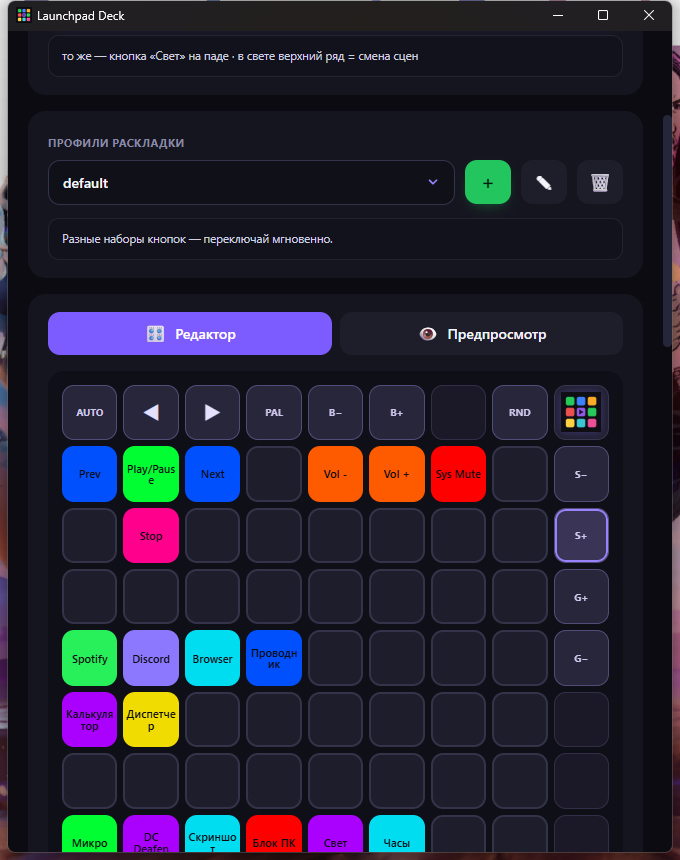

<div align="center">


# Launchpad Deck

**Turn your Novation Launchpad into a macro deck _and_ an audio-reactive light show — in one app.**
**Преврати свой Novation Launchpad в макро-деку и свето-музыку — в одном приложении.**

A free Stream-Deck-style controller **and** a 60+‑scene reactive light show for the Launchpad — one window, one `.exe`, no extra software, no subscription.

`Novation Launchpad` · `Stream Deck alternative` · `macro deck` · `MIDI controller` · `audio-reactive light show` · `Launchpad Mini MK3` · `Launchpad X` · `Launchpad Pro`

<br>



</div>

---

## ✨ Что это / What it is

**Launchpad Deck** делает из светового пэда Novation две вещи сразу:

- 🎛 **Макро-дека** (как Stream Deck) — назначай на кнопки запуск программ, медиа/громкость, мут микрофона (работает в Discord), блокировку ПК, часы, горячие клавиши, управление **OBS** и многое другое.
- 🎆 **Свето-музыка** — пэд реагирует на звук с ПК: бас бьёт, хай-хеты искрят, дропы вспыхивают. 60+ сцен с анимациями и персонажами.

Всё в одном окне, в одном установочном файле — Python и библиотеки ставить не нужно.

---

## 🚀 Возможности / Features

### 🎛 Macro deck
- Программируй каждый пэд: **запуск программ**, медиа (плей/пауза/трек), **громкость** (общая и **по приложениям** — `spotify:up`, `discord:mute`, `chrome:set:30`), **системный мут микрофона** (глушит везде, включая Discord), **блокировка ПК**, скриншот, запуск файла/сайта, **список программ одной кнопкой**, бегущие **часы** на пэде или просто цвет.
- 🎥 **OBS Studio** — смена сцены, старт/стоп записи, эфир, пауза, мут источника, повтор, вирт-камера (через obs-websocket).
- Цветовое оформление и подписи, живые анимации при нажатии на самом пэде.

### 🎆 Light show
- **60+ генеративных режимов**: спектр, барабаны, хай-хеты, персонажи (🐍 змейка, 🕺 танцор, 👾 инопланетянин, 🤖 робот), фейерверки, калейдоскоп, плазма, туннели и др.
- Реакция по частотам — **бас бьёт, хай-хеты искрят, снейры звенят**; **детект дропов**, спокойный idle с пасхалками.
- **Свои эффекты** — папка плагинов: пишешь `.py` с классом-эффектом на Python.

### 🖥 App
- **Редактор ⇄ Предпросмотр** — сетка 8×8 повторяет пэд в реальном времени; по краям — кнопки управления светом с описанием.
- 🗂 **Профили раскладки** — разные наборы кнопок (игры, стрим, работа), переключение мгновенно.
- 🌍 **6 языков**: Русский, English, Українська, Deutsch, Español, Français.
- 🚀 **Автозапуск** с Windows — сам находит пэд и поднимает последний конфиг.
- 💾 Экспорт/импорт раскладки, встроенное **обучение** (17 шагов), красивые анимации запуска и закрытия.

---

## 🎹 Поддерживаемые устройства / Supported devices

Автоопределение по SysEx — приложение **само подстраивает раскладку** под подключённую модель.

| Устройство | Сетка | Что даёт |
|---|---|---|
| **Launchpad Mini MK3** | 8×8 + верхний ряд + правый столбец | 64 макро-пэда, свето-музыка, управление светом на паде |
| **Launchpad X** | 8×8 + верхний ряд + правый столбец | то же, что Mini MK3 |
| **Launchpad Pro MK3** | **полная 10×10** | 8×8 + **левый столбец и нижний ряд как доп. макро-кнопки** (+80 действий), управление светом верхним рядом/правым столбцом |

<div align="center">


</div>

> **Адаптация под Pro:** программа определяет Launchpad Pro MK3 и рисует полное кольцо 10×10 в редакторе и предпросмотре. Внешние кнопки Pro (левый столбец, нижний ряд) — назначаемые макросы с подсветкой и анимацией, как обычные пэды. Реализовано по официальному программерскому референсу Novation.

## ▶️ Быстрый старт / Quick start
1. Скачай `LaunchpadDeck.exe` из [Releases](../../releases).
2. Подключи Launchpad по USB.
3. Запусти — приложение само найдёт пэд и подключится. Всё.

---

## 🧩 Типы действий и параметры / Actions & parameters

| Тип | Что делает | Параметр (пример) |
|---|---|---|
| Медиа/громкость | плей-пауза, трек, звук | `playpause` `next` `prev` `volup` `voldown` `mute` |
| Громкость приложения | громкость одной проги | `spotify:up` · `discord:mute` · `chrome:set:30` |
| OBS-студия | управление OBS | `scene:Игра` · `record` · `stream` · `mute:Микрофон` · `replay` |
| Микрофон / Звук | системный мут | — |
| Свето-музыка | вкл/выкл шоу | — |
| Часы | время на пэде | — |
| Блокировка ПК | заблокировать | — |
| Список программ | открыть несколько сразу | `magic;steelseries;spotify;telegram;chrome;discord` |
| Открыть прогу | запуск приложения | `spotify` `discord` `chrome` `telegram` `steelseries` |
| Горячая клавиша | комбинация | `ctrl+shift+alt+d` |
| Запустить файл | путь к .exe | `C:\...\app.exe` |
| Открыть сайт | ссылка | `https://...` |
| Просто цвет | подсветка без действия | — |

---

## 🛠 Сборка из исходников / Build from source
```bash
python -m venv .venv
.venv\Scripts\pip install numpy soundcard pygame pycaw comtypes pillow obsws-python pywebview pyinstaller
# Web UI (pywebview + Edge WebView2):
.venv\Scripts\pyinstaller --onefile --windowed --name LaunchpadDeck --icon deck_icon.ico ^
  --add-data "web;web" --add-data "deck_icon.ico;." --add-data "deck_icon.png;." ^
  --collect-all soundcard --collect-all pycaw --collect-all comtypes ^
  --collect-all obsws_python --collect-all websocket --collect-all webview --collect-all clr_loader ^
  --hidden-import webview.platforms.winforms --hidden-import clr app_web.py
```

## ⚙️ Tech notes
- Движок (звук/MIDI/свет) — Python; интерфейс — **HTML/CSS/JS в Edge WebView2** через `pywebview` (GPU-рендер, плавно, без пикселей). Всё в одном процессе.
- Захват звука через WASAPI loopback (`soundcard`), FFT + onset-детект (`numpy`).
- Вывод на пэд через **Windows winmm** SysEx; ввод — `pygame.midi`. Мут — Core Audio (`pycaw`). OBS — `obs-websocket`.

---

## 👤 Автор и права / Author & rights
**Автор:** Оськин Даниил Андреевич · **Universe Music Records**

© Все права защищены. Переработка, изменение, распространение и обновление программы — **только по согласованию с автором-разработчиком**.

- ✈️ Telegram: [@universemusicrecords](https://t.me/universemusicrecords)
- ✉️ Email: **doskin50@gmail.com**

<div align="center">

*Если проект понравился — поставь ⭐ на GitHub, это помогает другим найти его.*

</div>
