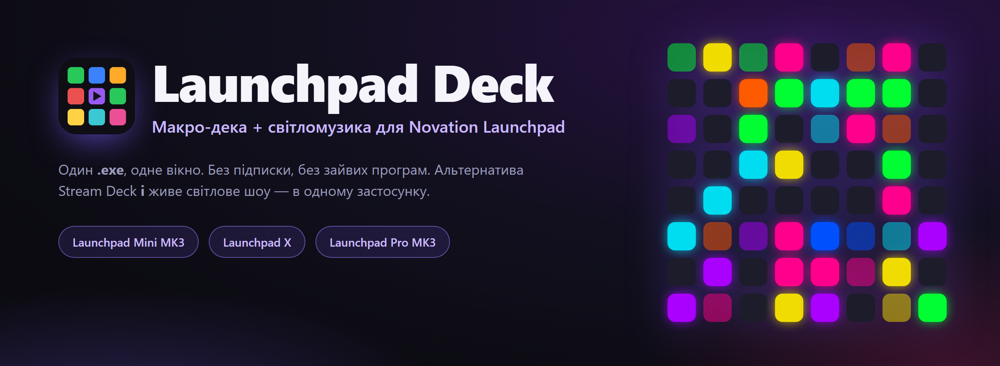
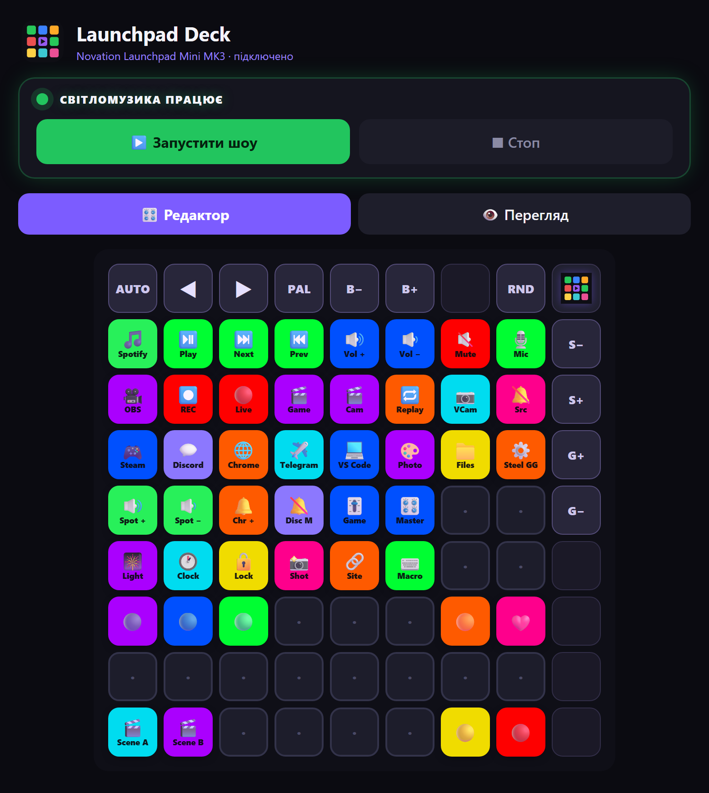
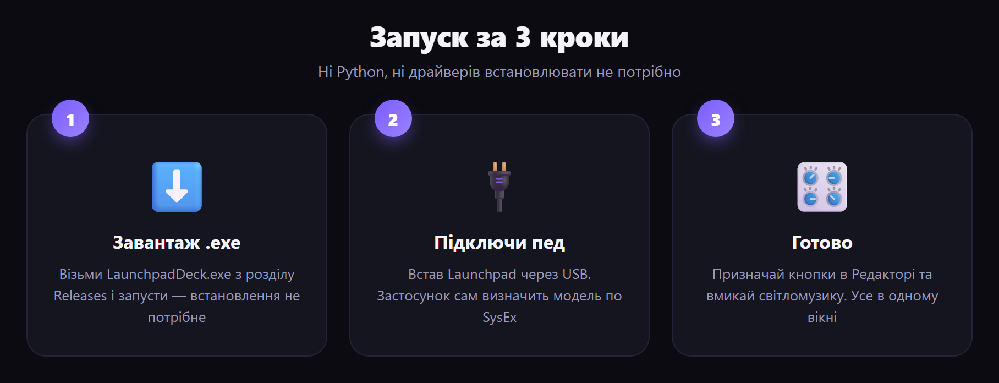
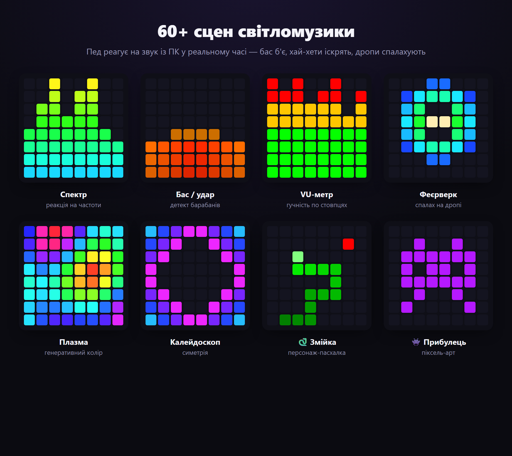
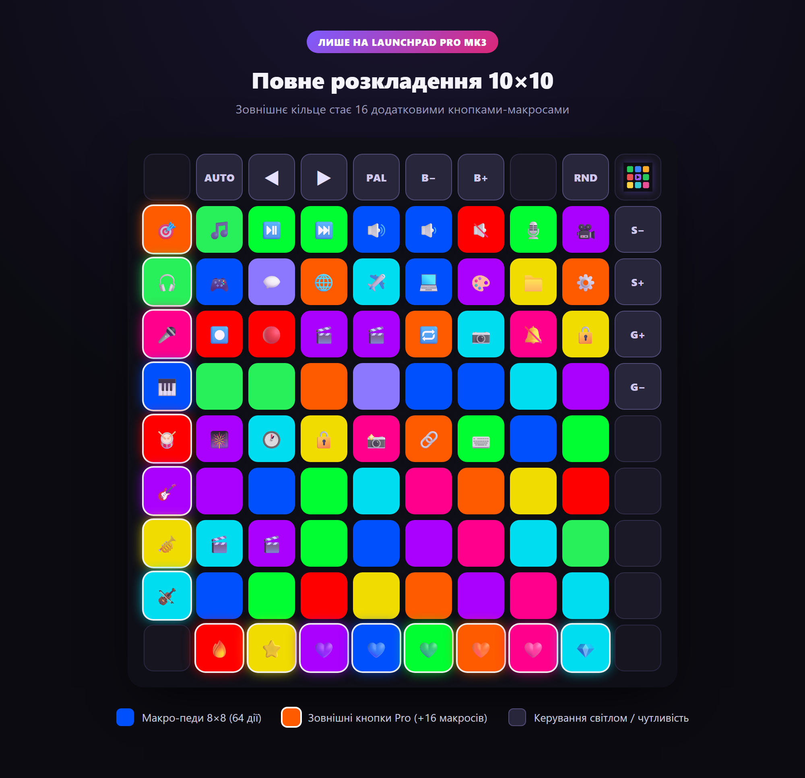

<div align="center">



<h1>Launchpad&nbsp;Deck</h1>

**Перетвори свій Novation Launchpad на макро-деку _та_ світломузику — в одному застосунку.**

<br>

[](../../releases/latest)
[](../../releases/latest)
[](../../releases)
[](../../stargazers)
[](#-збірка-з-вихідників)
[](https://t.me/universemusicrecords)
[](#-автор-і-права)

[Русский](README.md) · [English](README.en.md) · 🌍 **Українська** · [Deutsch](README.de.md) · [Español](README.es.md) · [Français](README.fr.md)

`Novation Launchpad` · `Stream Deck alternative` · `macro deck` · `MIDI controller` · `audio-reactive light show` · `Launchpad Mini MK3` · `Launchpad X` · `Launchpad Pro MK3`

<br>

### [⬇️&nbsp;&nbsp;Завантажити LaunchpadDeck.exe&nbsp;&nbsp;→](../../releases/latest)

<br>



</div>

---

## 📖 Зміст

- [✨ Що це](#-що-це)
- [🚀 Запуск за 3 кроки](#-запуск-за-3-кроки)
- [🎛 Можливості](#-можливості)
- [🎆 Світломузика](#-світломузика)
- [🎹 Підтримувані пристрої](#-підтримувані-пристрої)
- [🧩 Типи дій та параметри](#-типи-дій-та-параметри)
- [💡 Готові приклади розкладок](#-готові-приклади-розкладок)
- [🎥 Налаштування OBS](#-налаштування-obs)
- [🗂 Профілі, мови, автозапуск](#-профілі-мови-автозапуск)
- [❓ Питання та рішення](#-питання-та-рішення)
- [🛠 Збірка з вихідників](#-збірка-з-вихідників)
- [👤 Автор і права](#-автор-і-права)

---

## ✨ Що це

**Launchpad Deck** робить зі світлового педа Novation дві речі одразу:

- 🎛 **Макро-дека** (як Stream Deck) — призначай на кнопки запуск програм, медіа та гучність, мут мікрофона (працює в Discord), блокування ПК, гарячі клавіші, керування **OBS Studio та Streamlabs** і багато іншого.
- 🎆 **Світломузика** — пед реагує на звук із ПК: бас б'є, хай-хети іскрять, дропи спалахують. **69** сцен з анімаціями та персонажами, а бічні кнопки теж світяться в такт.

Усе в одному вікні, в одному `.exe` — Python і бібліотеки встановлювати **не потрібно**. Без підписки. Без хмари. Працює офлайн.

---

## 🚀 Запуск за 3 кроки

<div align="center">



</div>

1. Завантаж **[`LaunchpadDeck.exe`](../../releases/latest)** — встановлення не потрібне.
2. Підключи Launchpad через USB.
3. Запусти — застосунок сам знайде пед і модель. **Готово.**

> 💡 Перший запуск може зайняти кілька секунд (розпакування). Windows 10/11.

---

## 🎛 Можливості

### 🎛 Макро-дека
- Програмуй **кожен пед**: запуск програм, медіа (плей/пауза/трек), гучність — **загальна й по застосунках** (`spotify:up`, `discord:mute`, `chrome:set:30`), **системний мут мікрофона** (глушить усюди, включно з Discord), **блокування ПК**, скріншот, запуск файлу/сайту, **список програм однією кнопкою**, живий **годинник** просто на педі або просто колір.
- 🎥 **OBS Studio та Streamlabs Desktop** — зміна сцени (за номером або назвою), старт/стоп запису, ефір, мут джерела, повтор, вірт-камера. Вибір програми (Авто / OBS / Streamlabs) і кнопка **«Перевірити підключення»**.
- 🎛 **Готові профілі** з коробки — **Робота**, **Ігри**, **Стрім (OBS)**.
- Кольори та підписи, живі анімації при натисканні на самому педі.

### 🖥 Застосунок
- **Редактор ⇄ Перегляд** — сітка на екрані повторює пед у реальному часі; по краях — кнопки керування світлом з описом.
- 🗂 **Профілі розкладки** — різні набори кнопок (ігри, стрім, робота), миттєве перемикання.
- 🌍 **6 мов**: Русский, English, Українська, Deutsch, Español, Français — перемикаються однією кнопкою.
- 📥 **Згортання в трей** — при закритті вікно ховається в трей (зникає з панелі задач), а пед працює далі.
- 🔔 **Авто-перевірка оновлень** — застосунок сам звіряє версію з GitHub і показує банер із посиланням; налаштування при оновленні зберігаються.
- 🚀 **Автозапуск** з Windows — сам знаходить пед і піднімає останній конфіг, **і сам перемикається на нову версію** після оновлення.
- 💎 **Підтримка проєкту** — донат у TON просто із застосунку.
- 💾 Експорт/імпорт розкладки, вбудоване **навчання**, плавні анімації запуску та закриття.

---

## 🎆 Світломузика

Натисни **«Запустити шоу»** — і пед оживає під звук із твого ПК. Реакція йде за частотами: **бас б'є, снейри дзвенять, хай-хети іскрять**, а на дропі все **спалахує**.

<div align="center">



</div>

- **69 генеративних режимів**: спектр, барабани, хай-хети, персонажі (🐍 змійка, 🕺 танцюрист, 👾 прибулець, 🤖 робот), феєрверки, калейдоскоп, плазма, тунелі, лава, снігопад, радар, водоспад, серцебиття та ін.
- **Бічні та верхні кнопки продовжують поточний режим** — вони підхоплюють кольори активного ефекту по краях (частина шоу, а не статична підсвітка), основа лишається на сітці 8×8. Підлаштовується під пристрій: Mini — верх і правий стовпець, Pro — усе кільце.
- **Роздільна чутливість басу та хай-хетів** + яскравість — повзунками в застосунку **і просто з педа** (правий стовпець / верхній ряд).
- **Детект дропів**, спокійний idle-режим з пасхалками.
- **Свої ефекти** — папка плагінів: пишеш `.py` з класом-ефектом на Python, і він з'являється в списку сцен.

---

## 🎹 Підтримувані пристрої

Автовизначення по SysEx — застосунок **сам підлаштовує розкладку** під підключену модель.

| Пристрій | Сітка | Що дає |
|---|---|---|
| **Launchpad Mini MK3** | 8×8 + верхній ряд + правий стовпець | 64 макро-педи, світломузика, керування світлом на педі |
| **Launchpad X** | 8×8 + верхній ряд + правий стовпець | те саме, що Mini MK3 |
| **Launchpad Pro MK3** | **повна 10×10** | 8×8 + **лівий стовпець і нижній ряд як дод. макро-кнопки** (+16 дій), керування світлом верхнім рядом/правим стовпцем |

<div align="center">



</div>

> **Адаптація під Pro:** програма визначає Launchpad Pro MK3 і малює повне кільце 10×10 в редакторі та перегляді. Зовнішні кнопки Pro (лівий стовпець, нижній ряд) — призначувані макроси з підсвіткою й анімацією, як звичайні педи. Реалізовано за офіційним програмерським референсом Novation.

---

## 🧩 Типи дій та параметри

Кожному педу можна задати **тип** дії та **параметр**. Ось усі типи:

| Тип | Що робить | Параметр (приклад) |
|---|---|---|
| 🎵 Медіа/гучність | плей-пауза, трек, звук | `playpause` · `next` · `prev` · `volup` · `voldown` · `mute` · `stop` |
| 🔊 Гучність застосунку | гучність однієї програми | `spotify:up` · `discord:mute` · `chrome:set:30` |
| 🎥 OBS / Streamlabs | керування OBS Studio або Streamlabs | `scene:1` · `scene:Гра` · `record` · `stream` · `mute:Мікрофон` · `replay` · `virtualcam` |
| 🎙 Мікрофон / Звук | системний мут мікрофона | — |
| 🎆 Світломузика | увімк/вимк шоу | — |
| 🕐 Годинник | час рядком, що біжить, на педі | — |
| 🔒 Блокування ПК | заблокувати Windows | — |
| 🗂 Список програм | відкрити кілька одразу | `steam;spotify;telegram;chrome;discord` |
| 🚀 Відкрити програму | запуск застосунку | `spotify` · `discord` · `chrome` · `telegram` · `steam` |
| ⌨️ Гаряча клавіша | комбінація клавіш | `ctrl+shift+alt+d` |
| 📁 Запустити файл | шлях до .exe / документа | `C:\Games\game.exe` |
| 🔗 Відкрити сайт | посилання | `https://youtube.com` |
| 🎨 Просто колір | підсвітка без дії | — |

<details>
<summary><b>💡 Як це читати — формат параметрів</b></summary>

- **Гучність застосунку** — `ім'я:дія`. Дії: `up`, `down`, `mute`, `set:NN` (де NN — відсотки).
  Приклади: `spotify:up` · `chrome:down` · `discord:mute` · `game:set:70`.
- **OBS** — `команда` або `команда:аргумент`. `scene:Назва` змінює сцену; `mute:Джерело` глушить джерело; `record` / `stream` / `pause` / `replay` / `virtualcam` — перемикачі.
- **Список програм** — імена через `;`. Відкриває всі разом (зручно на «старт стріму»).
- **Гаряча клавіша** — модифікатори `ctrl` `shift` `alt` `win` + клавіша, через `+`.
- Імена програм (`spotify`, `discord`, `chrome`…) застосунок знаходить сам; для своїх — використовуй **Запустити файл** з повним шляхом.

</details>

---

## 💡 Готові приклади розкладок

Скопіюй ідею — признач педам такі дії під свій сценарій.

<details open>
<summary><b>🎥 Для стрімера</b></summary>

| Пед | Тип | Параметр |
|---|---|---|
| 🔴 Ефір увімк/вимк | OBS | `stream` |
| ⏺ Запис | OBS | `record` |
| 🎬 Сцена «Гра» | OBS | `scene:Гра` |
| 🎬 Сцена «Камера» | OBS | `scene:Камера` |
| 🔁 Повтор (replay) | OBS | `replay` |
| 🎙 Мут мікрофона | Мікрофон | — |
| 🔕 Мут «десктоп-звук» | OBS | `mute:Desktop Audio` |
| 🎆 Світломузика | Світломузика | — |

</details>

<details>
<summary><b>🎮 Для геймера</b></summary>

| Пед | Тип | Параметр |
|---|---|---|
| 🎮 Запустити гру | Запустити файл | `C:\Games\game.exe` |
| 💬 Discord | Відкрити програму | `discord` |
| 🔕 Мут у Discord | Гучність застосунку | `discord:mute` |
| 🎧 Тихіше Spotify | Гучність застосунку | `spotify:set:30` |
| 📸 Скріншот | Скріншот | — |
| 🔒 Заблокувати ПК | Блокування ПК | — |
| ⌨️ Push-to-talk / макрос | Гаряча клавіша | `ctrl+shift+m` |

</details>

<details>
<summary><b>💼 Для роботи та музики</b></summary>

| Пед | Тип | Параметр |
|---|---|---|
| 🚀 Робочий набір | Список програм | `chrome;telegram;spotify;vscode` |
| ⏯ Плей/пауза | Медіа | `playpause` |
| ⏭ Наступний трек | Медіа | `next` |
| 🔊 Гучніше Spotify | Гучність застосунку | `spotify:up` |
| 🕐 Годинник на педі | Годинник | — |
| 🔗 Відкрити пошту | Відкрити сайт | `https://mail.google.com` |
| 🎨 Просто підсвітка | Просто колір | — |

</details>

---

## 🎥 Налаштування OBS / Streamlabs

Підтримуються **обидві** програми. У застосунку: **Ще → OBS / Streamlabs** — обери програму (Авто / OBS Studio / Streamlabs Desktop) і натисни **«Перевірити підключення»**.

<details>
<summary><b>OBS Studio — покроково</b></summary>

1. У **OBS Studio** відкрий **Інструменти → Налаштування сервера WebSocket**.
2. Увімкни **«Увімкнути сервер WebSocket»**. Порт за замовчуванням — `4455`.
3. Якщо ввімкнено автентифікацію — скопіюй пароль і встав його в **Launchpad Deck → Ще → OBS / Streamlabs**.
4. Признач педам дії типу **OBS / Streamlabs** (параметри нижче).

</details>

<details>
<summary><b>Streamlabs Desktop — покроково</b></summary>

1. Просто тримай **Streamlabs Desktop** запущеним — додаткове налаштування не потрібне.
2. Якщо Streamlabs запущено **від імені адміністратора** — запусти **Launchpad Deck** теж від адміністратора.
3. Натисни **«Перевірити підключення»** — застосунок покаже сцени й запише файл `streamlabs_report.txt` з іменами сцен і аудіо-джерел.

</details>

**Параметри (для обох):** сцена — `scene:1` (за номером) або `scene:Назва`; запис — `record`, ефір — `stream`; мут джерела — `mute:Мікрофон` (або `mute:1`); повтор — `replay` (потрібен увімкнений Replay Buffer); вірт-камера — `virtualcam`.

> 💡 Зміна сцен **за номером** (`scene:1`, `scene:2`…) працює незалежно від назв твоїх сцен.

---

## 🗂 Профілі, мови, автозапуск

- **Профілі** — тримай окремі розкладки під «Стрім», «Ігри», «Роботу» й перемикайся миттєво. Створення, перейменування, видалення, експорт/імпорт — у картці профілів.
- **Мови** — 🇷🇺 🇬🇧 🇺🇦 🇩🇪 🇪🇸 🇫🇷, перемикання однією кнопкою; весь інтерфейс і навчання перекладені.
- **Автозапуск** — увімкни галочку, і дека стартує разом з Windows, сама знаходить пед і піднімає останній профіль. Після оновлення автозапуск **сам перемикається на нову версію**, яку ти запустив.
- **Трей** — при закритті вікно згортається в системний трей (і зникає з панелі задач), а дека працює далі; клік по іконці повертає вікно.
- **Оновлення** — застосунок перевіряє актуальну версію на GitHub і показує банер, якщо вийшла нова. Налаштування та профілі зберігаються.
- **Навчання** — вбудований гід проведе по всіх функціях.

---

## ❓ Питання та рішення

<details>
<summary><b>Пед не визначається</b></summary>

Перевір, що Launchpad підключений через USB і не зайнятий іншою програмою (Ableton, Novation Components, браузерний MIDI). Закрий їх і перезапусти деку — вона сама перепідключиться.
</details>

<details>
<summary><b>Світломузика не реагує на звук</b></summary>

Застосунок слухає **звук із ПК** (WASAPI loopback) — на пристрої виводу має йти звук. Перевір, що музика/гра грають через той самий пристрій, що стоїть у Windows «за замовчуванням».
</details>

<details>
<summary><b>Мут мікрофона не спрацьовує в Discord</b></summary>

Використовуй тип **Мікрофон / Звук** (системний мут) — він глушить мікрофон на рівні Windows, тому працює в усіх програмах, включно з Discord і OBS.
</details>

<details>
<summary><b>OBS не підключається</b></summary>

Переконайся, що в OBS увімкнено **WebSocket server** (порт `4455`) і, якщо ввімкнена автентифікація, пароль вставлено в картку **Ще → OBS**. Назви сцен/джерел мають збігатися точнісінько.
</details>

<details>
<summary><b>Windows SmartScreen попереджає при запуску</b></summary>

Це звичайна поведінка для нових `.exe` без платного підпису. Натисни **«Докладніше → Виконати в будь-якому разі»**. Вихідники відкриті — можеш зібрати сам (нижче).
</details>

---

## 🛠 Збірка з вихідників

```bash
python -m venv .venv
.venv\Scripts\pip install numpy soundcard pygame pycaw comtypes pillow obsws-python pywebview pyinstaller

# Web UI (pywebview + Edge WebView2):
.venv\Scripts\pyinstaller --onefile --windowed --name LaunchpadDeck --icon deck_icon.ico ^
  --add-data "web;web" --add-data "deck_icon.ico;." --add-data "deck_icon.png;." ^
  --collect-all soundcard --collect-all pycaw --collect-all comtypes ^
  --collect-all obsws_python --collect-all websocket --collect-all webview --collect-all clr_loader ^
  --hidden-import webview.platforms.winforms --hidden-import clr app_web.py
```

Точка входу — [`app_web.py`](app_web.py). Рушій — [`deck.py`](deck.py) (+ [`lightshow.py`](lightshow.py), [`winmidi.py`](winmidi.py)); інтерфейс — [`web/`](web/); переклади — [`i18n.py`](i18n.py).

### ⚙️ Як влаштовано
- Рушій (звук/MIDI/світло) — **Python**; інтерфейс — **HTML/CSS/JS в Edge WebView2** через `pywebview` (GPU-рендер, плавно, без пікселів). Усе в **одному процесі**, одне вікно.
- Захоплення звуку — WASAPI loopback (`soundcard`); аналіз — FFT + onset-детект (`numpy`).
- Вивід на пед — **Windows winmm** SysEx (Programmer mode); ввід — `pygame.midi`. Мут і гучність застосунків — Core Audio (`pycaw`). OBS — `obs-websocket`.

---

## 💜 Підтримати проєкт

Проєкт безкоштовний. Якщо він тобі допоміг — можна підтримати автора криптою **TON (Toncoin)**:

```
UQAK1sIJqPVn9ND8JTOEUlrBFyAiVU0j6IiiXczTM7YmX4CB
```

[**💎 Надіслати TON →**](https://app.tonkeeper.com/transfer/UQAK1sIJqPVn9ND8JTOEUlrBFyAiVU0j6IiiXczTM7YmX4CB)

---

## 👤 Автор і права

**Автор:** Оськін Даниїл Андрійович · **Universe Music Records**

© Усі права захищені. Переробка, зміна, поширення й оновлення програми — **лише за погодженням з автором-розробником**.

- ✈️ Telegram: **[@universemusicrecords](https://t.me/universemusicrecords)**
- ✉️ Email: **doskin50@gmail.com**

<div align="center">

<br>

**Сподобався проєкт? Постав ⭐ — це допомагає іншим його знайти.**

<br>

<sub>Launchpad Deck © Universe Music Records · Novation і Launchpad — торговельні марки Focusrite Audio Engineering. Проєкт не афілійований з Novation.</sub>

</div>
